# Smart Home — Class Diagrams

A focused diagram per design pattern, plus two overview diagrams (system
architecture and full class hierarchy). Each section can be read in
isolation — start with whichever pattern you want to understand first.

> **Viewing this:** GitHub renders Mermaid diagrams natively. Just open
> [this file on github.com](https://github.com/ahmefarouk1234d/smarthome/blob/main/docs/class-diagram.md)
> and every code block below appears as a rendered diagram.
>
> For the printed report, use the higher-resolution PlantUML version
> in [`class-diagram.puml`](class-diagram.puml) (see [`README.md`](README.md)
> for rendering instructions).

---

## Table of contents

1. [System architecture (layered view)](#1-system-architecture-layered-view)
2. [Singleton — `SmartHomeHub`, `Database`](#2-singleton)
3. [Iterator — `Room.devices()` and `RoomIterator`](#3-iterator)
4. [Observer — `Device` and friends](#4-observer)
5. [Abstract Factory + Factory Methods](#5-abstract-factory--factory-methods)
6. [Strategy — automation modes](#6-strategy)
7. [Command — actions with undo](#7-command)
8. [Decorator — wrapping devices](#8-decorator)
9. [DAO — persistence layer](#9-dao)
10. [Facade — `HomeController`](#10-facade)
11. [Putting it together — request flow](#11-putting-it-together)

---

## 1. System architecture (layered view)

How packages stack. Each layer depends only on layers below it.

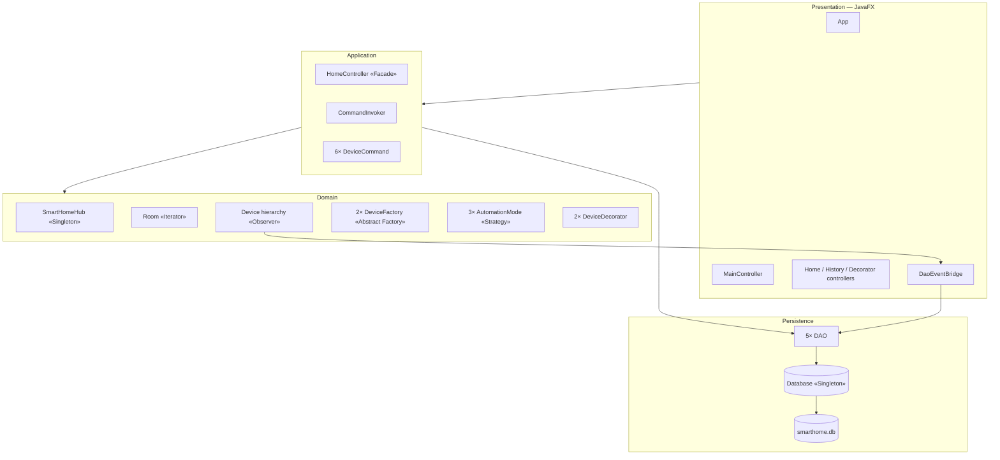

---

## 2. Singleton

One global instance per class. Used for the smart-home **hub** and the
**database connection**.

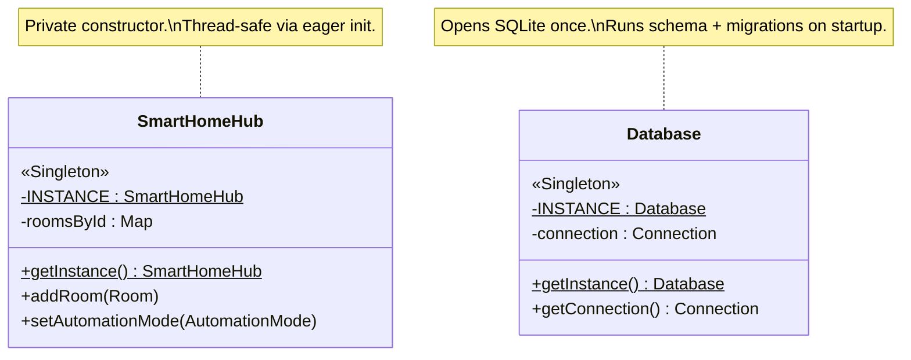

**Methods that *make* it the pattern**: `getInstance()` (static accessor),
private constructor, single `INSTANCE` field.

---

## 3. Iterator

`Room.devices()` returns `Enumeration<Device>` — that's the rubric
requirement. Plus a custom **GoF-style** Iterator (`RoomIterator`) at the
hub level for stronger pattern coverage.

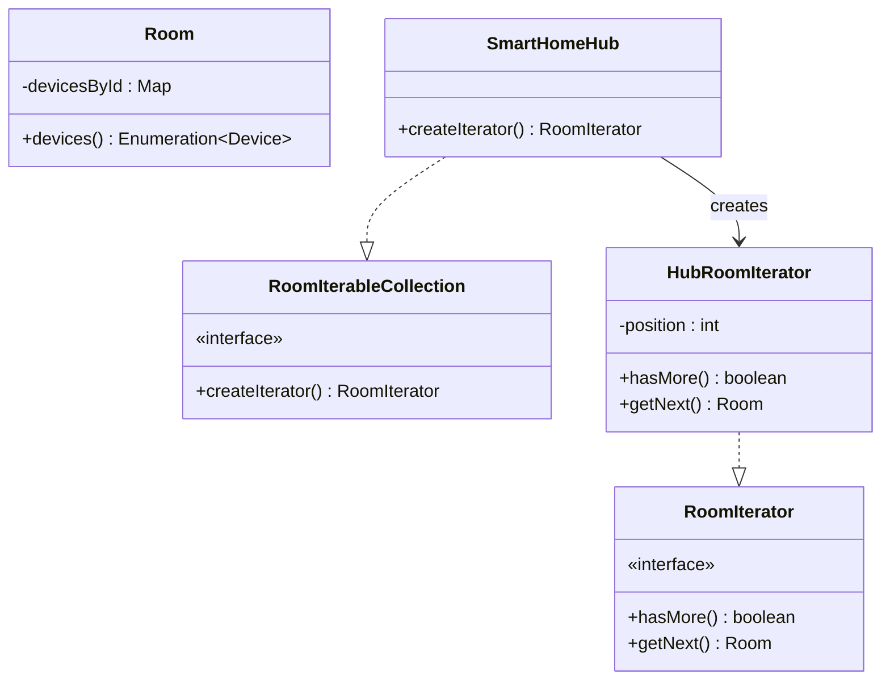

Two iterator implementations on purpose: `Enumeration<Device>` is what the
brief literally asks for; `RoomIterator` is the textbook GoF version with
`hasMore() / getNext()`.

---

## 4. Observer

Devices fire `notifyObservers(event)` after every state change. Multiple
listeners attach: live UI controllers + the persistence-side
`DaoEventBridge`.

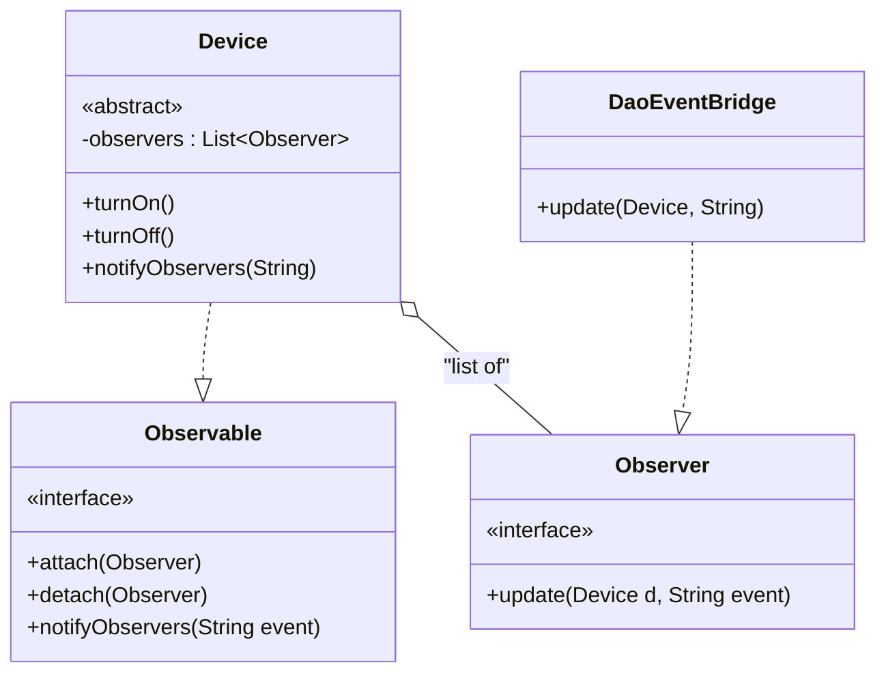

**Push, not pull.** When `Device.turnOn()` runs, observers are pushed
both the device and the event string — no polling.

---

## 5. Abstract Factory + Factory Methods

`DeviceFactory` is the Abstract Factory; each `create…` method is a
Factory Method. Two **families** of products: `Version1` (legacy) and
`Version2` (modern). Each family produces the full set of 4 device
types — so no `UnsupportedOperationException` throws (LSP-clean).

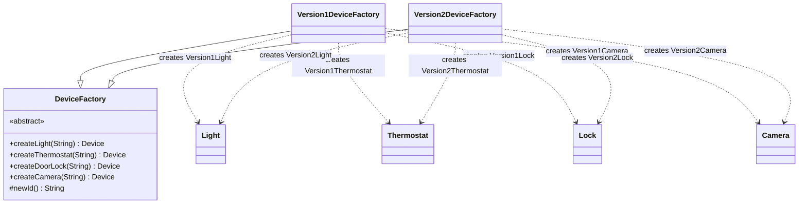

(For brevity each family's concrete subclasses — `Version1Light` etc. —
are shown only as the type their family creates.)

---

## 6. Strategy

`AutomationMode` is the strategy interface. Three concrete strategies
(`Eco`, `Sleep`, `Away`) define different home behaviours. The
`SmartHomeHub` is the **Context** — it holds the current strategy and
delegates via `applyAutomationMode()`.

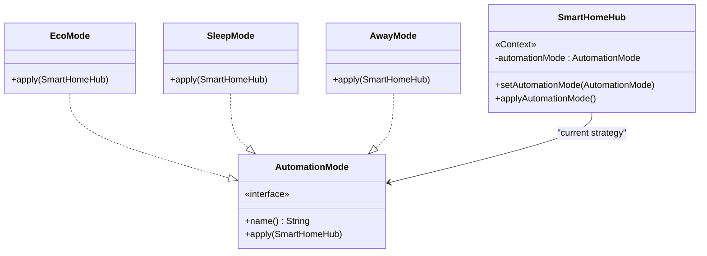

Each `apply()` walks rooms via Iterator and mutates devices via setters
that fire Observer events — three patterns collaborating in one call.

---

## 7. Command

Each user action is a `DeviceCommand` object — encapsulates `execute()`
and `undo()`. The `CommandInvoker` keeps a history stack so the most
recent action can be reversed. Optionally writes a row to `commands_log`
on every execute.

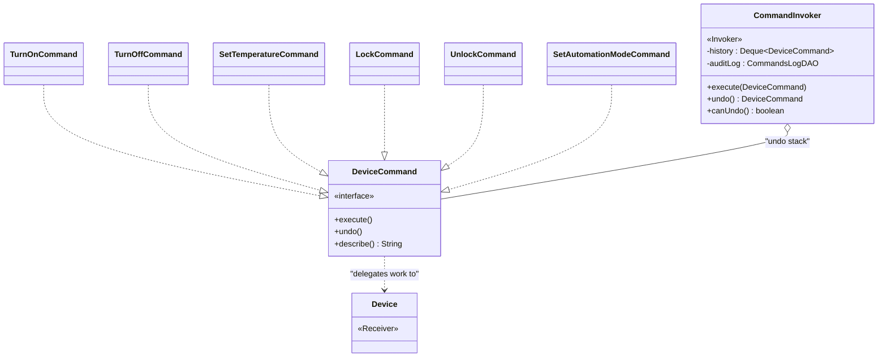

**Invoker never imports Device directly** — RG's litmus test for a
correct Command implementation. The Invoker only knows `DeviceCommand`.

---

## 8. Decorator

Wraps a `Device` to add cross-cutting behaviour (logging, energy
tracking) without modifying its class. Decorators stack — you can wrap
a wrapped wrapper.

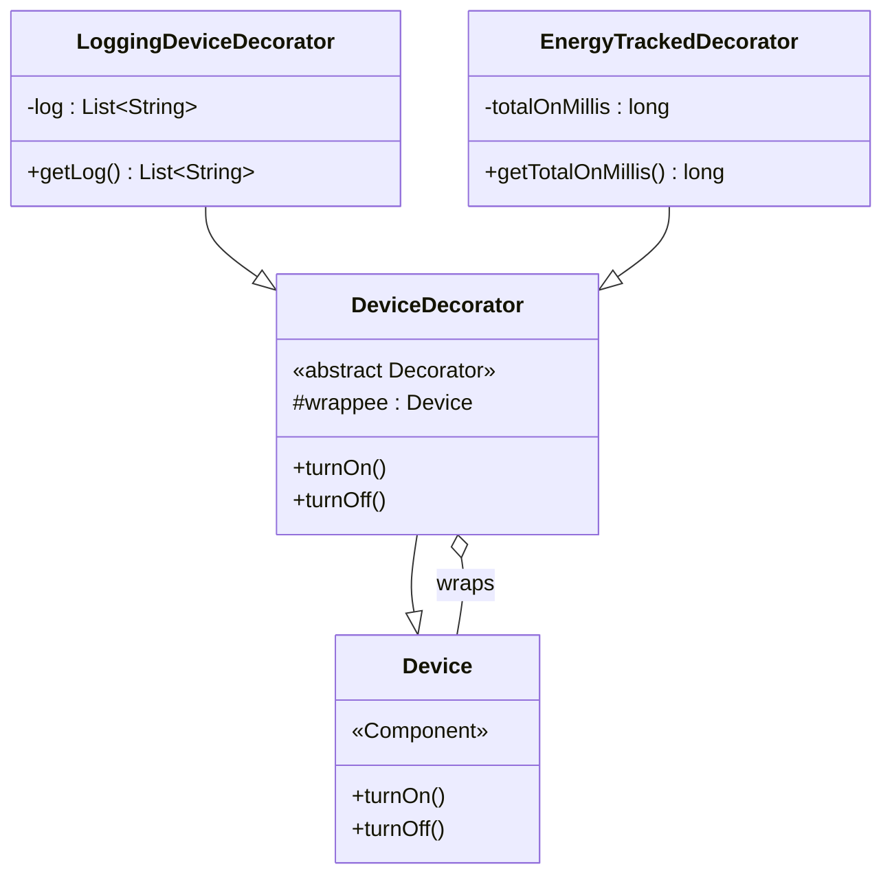

Each decorator carries the wrapped device's `id` and `name` — so the
wrapper IS the same logical device for room indexing and audit logs.

---

## 9. DAO

Five DAOs isolate all SQL behind plain Java APIs. The domain layer never
sees JDBC. Every DAO has a dual constructor: production uses the singleton
`Database`; tests inject an in-memory `Connection`.

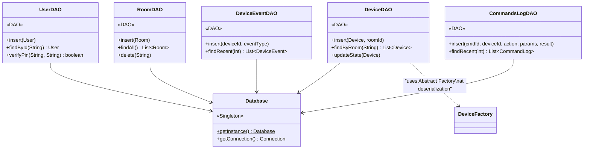

`DeviceDAO` is the most interesting — it round-trips polymorphic `Device`
subtypes through one row, using the Abstract Factory at runtime to
reconstruct the right family/type.

---

## 10. Facade

`HomeController` is the only class the UI talks to. It delegates to the
hub, the command invoker, and the DAOs — never reimplements domain logic.

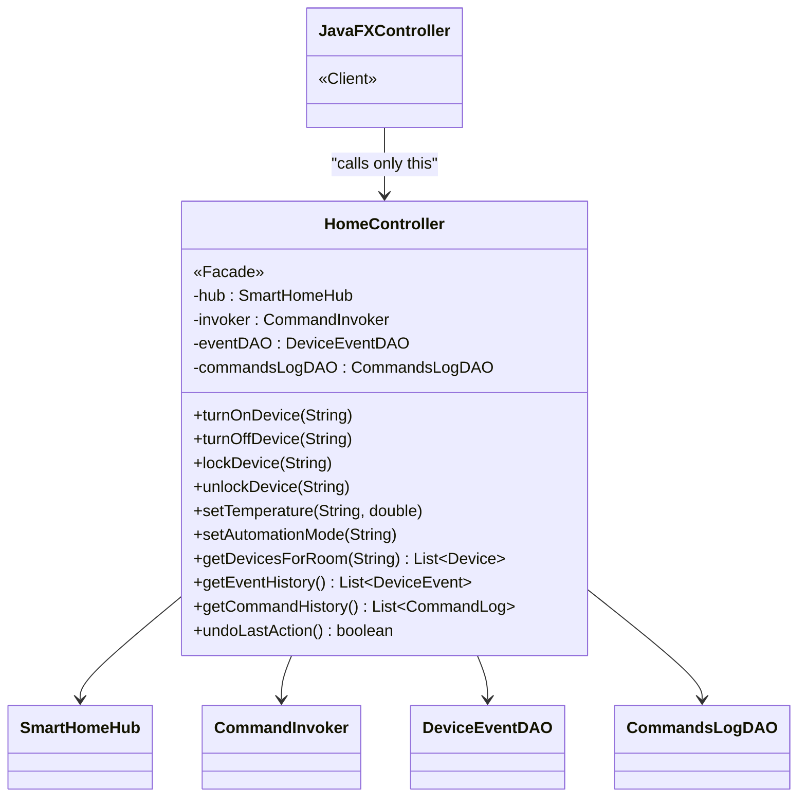

**Thin Facade rule** (RG): every method here is one or two lines —
build a Command and hand it to the Invoker, or read from a DAO. No
domain logic.

---

## 11. Putting it together — request flow

How a single user action flows through the system, exercising 6 patterns
in one trip.

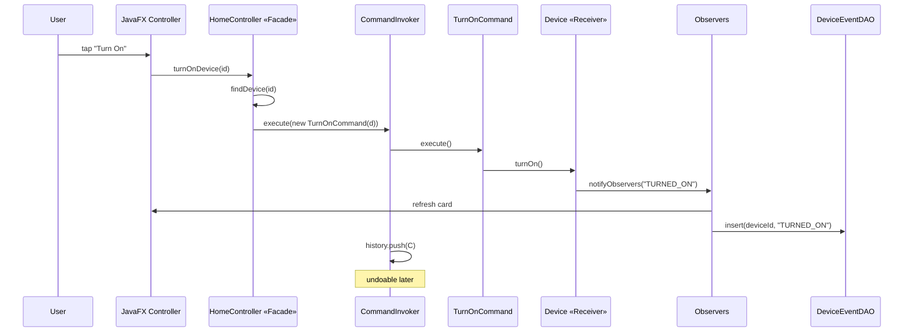

Patterns visible in this single flow:
- **Facade** — UI calls only `HomeController`
- **Command** — every action becomes a `TurnOnCommand` object
- **Receiver** (Command) — `Device` does the actual work
- **Observer** — `notifyObservers` fans out to UI and DAO
- **DAO** — `DeviceEventDAO.insert` writes to SQLite
- **Singleton** — `HomeController` reaches `SmartHomeHub.getInstance()` to find the device

---

## Pattern roles at a glance

| Pattern | Roles | Key classes |
|---|---|---|
| **Singleton** | One instance | `SmartHomeHub`, `Database` |
| **Iterator** | Aggregate + Iterator | `Room` (Enumeration), `RoomIterator` |
| **Observer** | Subject + Observer | `Device`, `Observer` interface, `DaoEventBridge` |
| **Abstract Factory** | Abstract + 2 concretes | `DeviceFactory`, `Version1/Version2DeviceFactory` |
| **Strategy** | Strategy + concretes + Context | `AutomationMode`, `Eco/Sleep/Away`, `SmartHomeHub` |
| **Command** | Command + Concretes + Invoker + Receiver | `DeviceCommand`, 6 commands, `CommandInvoker`, `Device` |
| **Decorator** | Component + Base + Concretes | `Device`, `DeviceDecorator`, `LoggingDeviceDecorator`, `EnergyTrackedDecorator` |
| **DAO** | Persistence isolation | 5 DAOs |
| **Facade** | Single entry point | `HomeController` |
