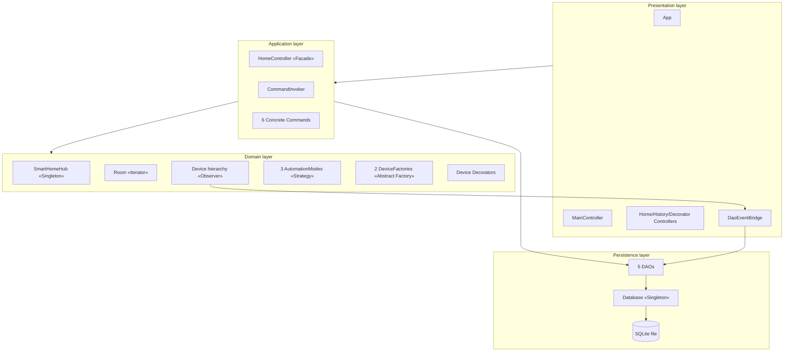

# Smart Home — Class Diagram

This diagram shows every implemented design pattern and how the
key classes relate. Stereotypes (`«Singleton»`, `«Strategy»`, etc.)
mark each class's role in the pattern it belongs to.

> **Tip — viewing this:** GitHub renders Mermaid diagrams natively.
> Open this file on github.com/ahmefarouk1234d/smarthome/blob/main/docs/class-diagram.md
> and the diagram below appears as an SVG. For a higher-resolution
> version in the report, see `docs/class-diagram.puml` and render at
> [plantuml.com](https://www.plantuml.com/plantuml/) or in draw.io.

---

## Pattern overview (Mermaid)

```mermaid
classDiagram
    direction TB

    %% ───────── Singleton + Iterator + Strategy holder ─────────
    class SmartHomeHub {
        «Singleton»
        -INSTANCE: SmartHomeHub
        -roomsById: Map
        -automationMode: AutomationMode
        +getInstance() SmartHomeHub
        +addRoom(Room)
        +setAutomationMode(AutomationMode)
        +applyAutomationMode()
        +createIterator() RoomIterator
    }

    class Room {
        «Iterator host»
        -devicesById: Map
        +addDevice(Device)
        +devices() Enumeration~Device~
    }

    class RoomIterator {
        «Iterator»
        +hasMore() boolean
        +getNext() Room
    }

    class HubRoomIterator {
        +hasMore() boolean
        +getNext() Room
    }

    %% ───────── Observer ─────────
    class Observer {
        «interface»
        +update(Device, String)
    }

    class Observable {
        «interface»
        +attach(Observer)
        +detach(Observer)
        +notifyObservers(String)
    }

    %% ───────── Devices (Receiver in Command, Component in Decorator) ─────────
    class Device {
        «abstract»
        -id: String
        -name: String
        -observers: List~Observer~
        +turnOn()
        +turnOff()
        +isPoweredOn() boolean
        +attach(Observer)
        +notifyObservers(String)
    }

    class Light {
        -brightness: int
        +setBrightness(int)
    }
    class Thermostat {
        -temperature: double
        +setTemperature(double)
    }
    class Lock {
        -locked: boolean
        +lock()
        +unlock()
    }
    class Camera

    %% ───────── Abstract Factory + Factory Methods ─────────
    class DeviceFactory {
        «abstract»
        +createLight(String) Device
        +createThermostat(String) Device
        +createDoorLock(String) Device
        +createCamera(String) Device
    }
    class Version1DeviceFactory
    class Version2DeviceFactory

    %% ───────── Strategy ─────────
    class AutomationMode {
        «interface»
        +name() String
        +apply(SmartHomeHub)
    }
    class EcoMode
    class SleepMode
    class AwayMode

    %% ───────── Command ─────────
    class DeviceCommand {
        «interface»
        +execute()
        +undo()
        +describe() String
    }
    class TurnOnCommand
    class TurnOffCommand
    class SetTemperatureCommand
    class LockCommand
    class UnlockCommand
    class SetAutomationModeCommand
    class CommandInvoker {
        «Invoker»
        -history: Deque~DeviceCommand~
        -auditLog: CommandsLogDAO
        +execute(DeviceCommand)
        +undo() DeviceCommand
    }

    %% ───────── Decorator ─────────
    class DeviceDecorator {
        «abstract Decorator»
        #wrappee: Device
    }
    class LoggingDeviceDecorator
    class EnergyTrackedDecorator

    %% ───────── Facade ─────────
    class HomeController {
        «Facade»
        -hub: SmartHomeHub
        -invoker: CommandInvoker
        -eventDAO: DeviceEventDAO
        +turnOnDevice(String)
        +setAutomationMode(String)
        +getEventHistory() List~DeviceEvent~
        +undoLastAction() boolean
    }

    %% ───────── DAO + Database ─────────
    class Database {
        «Singleton»
        -INSTANCE: Database
        -connection: Connection
        +getInstance() Database
    }
    class UserDAO {
        «DAO»
    }
    class RoomDAO {
        «DAO»
    }
    class DeviceDAO {
        «DAO»
    }
    class DeviceEventDAO {
        «DAO»
    }
    class CommandsLogDAO {
        «DAO»
    }

    %% ───────── UI (briefly) ─────────
    class App {
        «JavaFX entry»
        +start(Stage)
    }
    class DaoEventBridge {
        «Observer adapter»
        -eventDao: DeviceEventDAO
        -deviceDao: DeviceDAO
        +update(Device, String)
    }

    %% ───────── Inheritance ─────────
    Light       --|> Device
    Thermostat  --|> Device
    Lock        --|> Device
    Camera      --|> Device
    DeviceDecorator --|> Device
    LoggingDeviceDecorator   --|> DeviceDecorator
    EnergyTrackedDecorator   --|> DeviceDecorator

    Version1DeviceFactory --|> DeviceFactory
    Version2DeviceFactory --|> DeviceFactory

    EcoMode   ..|> AutomationMode
    SleepMode ..|> AutomationMode
    AwayMode  ..|> AutomationMode

    TurnOnCommand           ..|> DeviceCommand
    TurnOffCommand          ..|> DeviceCommand
    SetTemperatureCommand   ..|> DeviceCommand
    LockCommand             ..|> DeviceCommand
    UnlockCommand           ..|> DeviceCommand
    SetAutomationModeCommand..|> DeviceCommand

    HubRoomIterator ..|> RoomIterator
    Device          ..|> Observable
    DaoEventBridge  ..|> Observer

    %% ───────── Composition / aggregation ─────────
    SmartHomeHub o-- Room              : aggregates rooms
    Room         o-- Device            : aggregates devices
    Device       o-- Observer          : list of observers
    DeviceDecorator o-- Device         : wraps
    SmartHomeHub --> AutomationMode    : current strategy
    CommandInvoker o-- DeviceCommand   : history stack
    CommandInvoker --> CommandsLogDAO  : audit log

    %% ───────── Facade dependencies ─────────
    HomeController --> SmartHomeHub
    HomeController --> CommandInvoker
    HomeController --> DeviceEventDAO
    HomeController --> CommandsLogDAO

    %% ───────── DAO ↔ Database ─────────
    UserDAO          --> Database
    RoomDAO          --> Database
    DeviceDAO        --> Database
    DeviceEventDAO   --> Database
    CommandsLogDAO   --> Database

    %% ───────── DeviceDAO uses Abstract Factory at runtime ─────────
    DeviceDAO --> DeviceFactory : reconstructs via

    %% ───────── App wiring ─────────
    App --> SmartHomeHub : seeds rooms
    App --> Database     : initialises
    App --> DaoEventBridge : attaches to devices
    DaoEventBridge --> DeviceEventDAO
    DaoEventBridge --> DeviceDAO
```

---

## Pattern roles at a glance

| Pattern | Roles in this diagram | Key classes |
|---|---|---|
| **Singleton** | The lone instance | `SmartHomeHub`, `Database` |
| **Iterator** | Aggregate + Iterator | `Room` (returns `Enumeration<Device>`), `SmartHomeHub` (returns `RoomIterator`) |
| **Observer** | Subject + Observer | `Device` implements `Observable`; UI controllers + `DaoEventBridge` are `Observer`s |
| **Abstract Factory + Factory Methods** | Abstract Factory + concrete families | `DeviceFactory`, `Version1DeviceFactory`, `Version2DeviceFactory` |
| **Strategy** | Strategy interface + concrete strategies + Context | `AutomationMode`, `Eco/Sleep/AwayMode`, `SmartHomeHub` |
| **Command** | Command + Concrete Commands + Invoker + Receiver | `DeviceCommand`, 6 commands, `CommandInvoker`, `Device` |
| **Decorator** | Component + Base Decorator + Concrete Decorators | `Device` (component), `DeviceDecorator`, `LoggingDeviceDecorator`, `EnergyTrackedDecorator` |
| **DAO** | Persistence isolation | `UserDAO`, `RoomDAO`, `DeviceDAO`, `DeviceEventDAO`, `CommandsLogDAO` |
| **Facade** | Single entry point for the UI | `HomeController` (in `facade` package) |

---

## Layered architecture view

