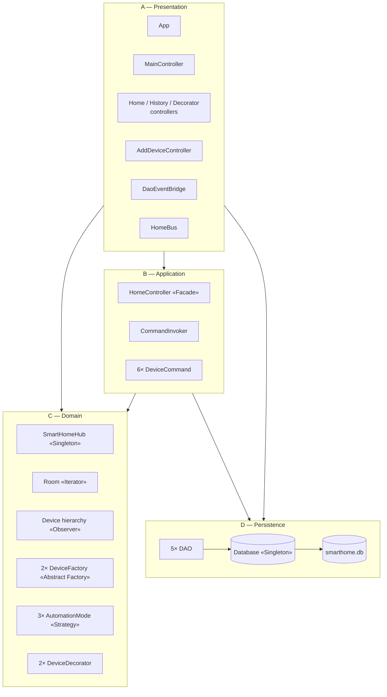
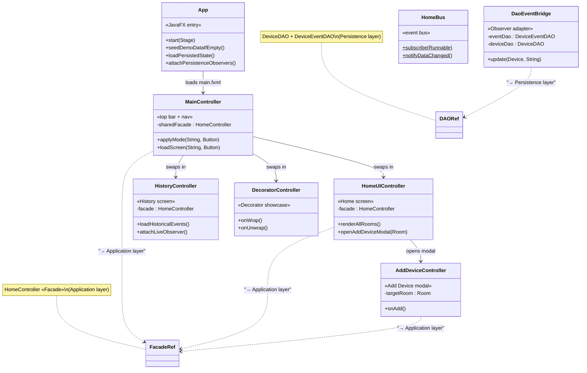
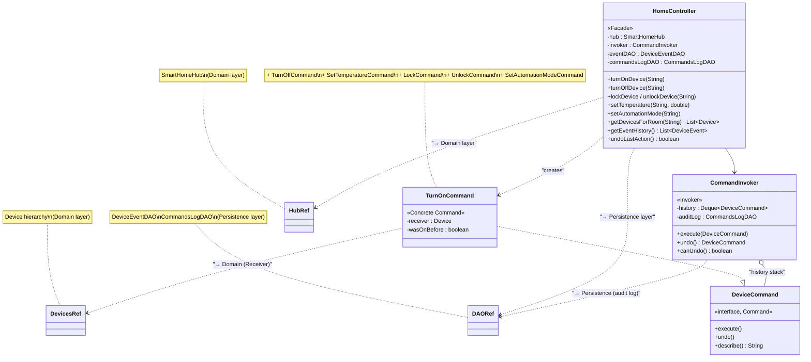
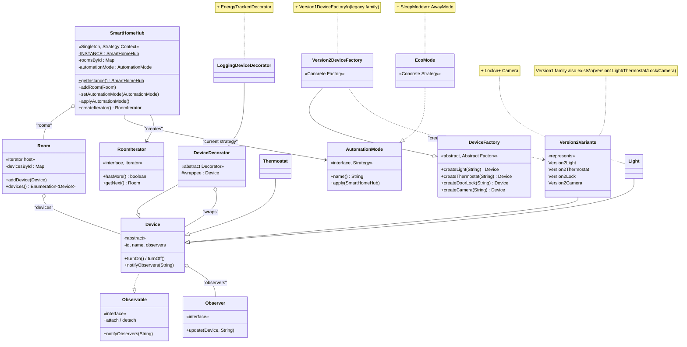
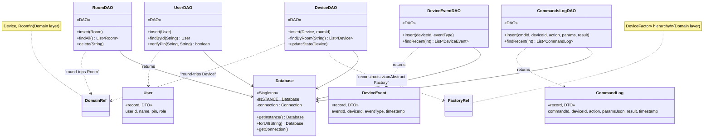
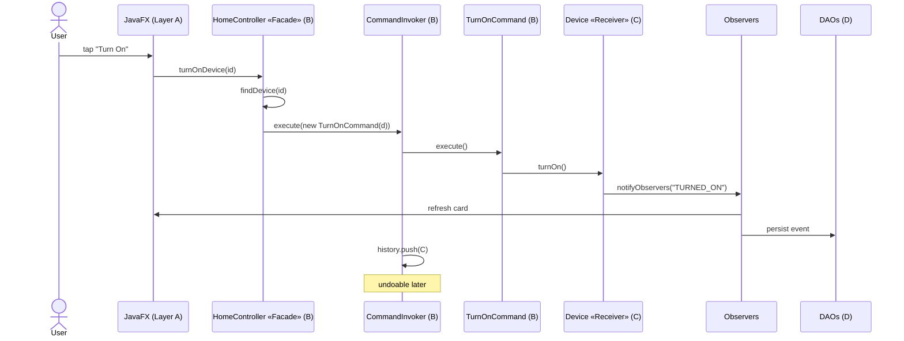

# Smart Home — Class Diagrams (by layer)

The system is organised into **4 layers**: Presentation, Application,
Domain, and Persistence. Each layer gets its own focused class diagram
below — showing the classes inside it plus the boundary arrows pointing
to the layers it depends on.

To keep each diagram readable, repetitive concrete classes are
represented by a single example per family (e.g. one `EcoMode` stands
in for `EcoMode/SleepMode/AwayMode`). Notes call out the omitted siblings.

> **Viewing this:** GitHub renders Mermaid natively — open
> [this file on github.com](https://github.com/ahmefarouk1234d/smarthome/blob/main/docs/class-diagram.md)
> and every diagram below appears as an SVG.
> For the printed report, see the higher-resolution
> [`class-diagram.puml`](class-diagram.puml).

---

## Table of contents

1. [Layered architecture overview](#1-layered-architecture-overview)
2. [Layer A — Presentation (JavaFX UI)](#2-layer-a--presentation-javafx-ui)
3. [Layer B — Application (Facade + Command)](#3-layer-b--application-facade--command)
4. [Layer C — Domain (Hub, Devices, Patterns)](#4-layer-c--domain-hub-devices-patterns)
5. [Layer D — Persistence (Database + DAOs)](#5-layer-d--persistence-database--daos)
6. [Putting it together — request flow](#6-putting-it-together--request-flow)

---

## 1. Layered architecture overview

How the four layers stack. Dependencies flow downward only — UI never
imports DAOs directly, the Domain layer is reusable in isolation.

---

## 2. Layer A — Presentation (JavaFX UI)

The visible application: an `App` that boots JavaFX, a `MainController`
that owns the chrome (top bar, mode picker, status banner, bottom nav),
plus three screen controllers swapped through the central host.
`DaoEventBridge` is a special Observer that lives at the layer boundary
and forwards device events to the Persistence layer.

**Imports allowed from:** Application (Facade) and Persistence (DAOs through `DaoEventBridge` only).

**Pattern roles in this layer:** `DaoEventBridge` is an **Observer**.
The whole presentation layer demonstrates the **Facade** rubric line
("controllers must call a facade service") — every controller's
mutation path goes through `HomeController` exclusively.

---

## 3. Layer B — Application (Facade + Command)

The orchestration layer. `HomeController` is the Facade — the single
class the UI calls into. It wraps every mutation in a `DeviceCommand`
and hands it to the `CommandInvoker`, which executes and stores the
command on the undo stack.

**Imports allowed from:** Domain (Hub, Devices, Strategies) and Persistence (DAOs).

**Pattern roles in this layer:** **Facade** (`HomeController`),
**Command** (interface + 6 concretes + `CommandInvoker`).

---

## 4. Layer C — Domain (Hub, Devices, Patterns)

The pure business model — no JavaFX imports, no SQL imports. Owns the
core entities (`SmartHomeHub`, `Room`, `Device`) and the foundational
patterns (Singleton, Iterator, Observer, Abstract Factory, Strategy,
Decorator).

**Imports allowed from:** *nothing higher in the stack*. The Domain layer
is reusable in isolation.

**Pattern roles in this layer:** **Singleton** (Hub), **Iterator** (Room
+ RoomIterator), **Observer** (Device implements Observable), **Abstract
Factory + Factory Methods** (DeviceFactory + 2 family factories),
**Strategy** (AutomationMode + 3 modes), **Decorator** (DeviceDecorator
+ 2 wrappers). Six of the nine patterns live entirely in this layer.

---

## 5. Layer D — Persistence (Database + DAOs)

SQL isolation. The `Database` is a Singleton holding the JDBC connection;
each DAO wraps a single table behind plain Java methods. The domain
layer never sees JDBC.

**Imports allowed from:** Domain (`Device`, `Room`, etc. as method args)
and `factory` (DeviceDAO uses Abstract Factory at deserialization).

**Pattern roles in this layer:** **Singleton** (Database) and **DAO**
(5 DAOs). `DeviceDAO` also calls into the Domain's Abstract Factory
at deserialization — visible as the dashed arrow leaving the layer.

---

## 6. Putting it together — request flow

How a single user gesture flows across all four layers, exercising six
patterns in one trip.

Patterns visible in this single flow:
- **Facade** — UI calls only `HomeController`
- **Command** — every action becomes a `TurnOnCommand` object
- **Receiver** (Command) — `Device` does the actual work
- **Observer** — `notifyObservers` fans out to UI and DAO
- **DAO** — `DeviceEventDAO.insert` writes to SQLite
- **Singleton** — `HomeController` reaches `SmartHomeHub.getInstance()` to find the device

---

## Pattern roles by layer at a glance

| Layer | Patterns it owns |
|---|---|
| **A — Presentation** | Observer (`DaoEventBridge`) at the boundary |
| **B — Application** | Facade · Command |
| **C — Domain** | Singleton · Iterator · Observer · Abstract Factory · Strategy · Decorator |
| **D — Persistence** | Singleton · DAO |
| **All 9** | spread across A/B/C/D — but the Domain layer is the heart |
