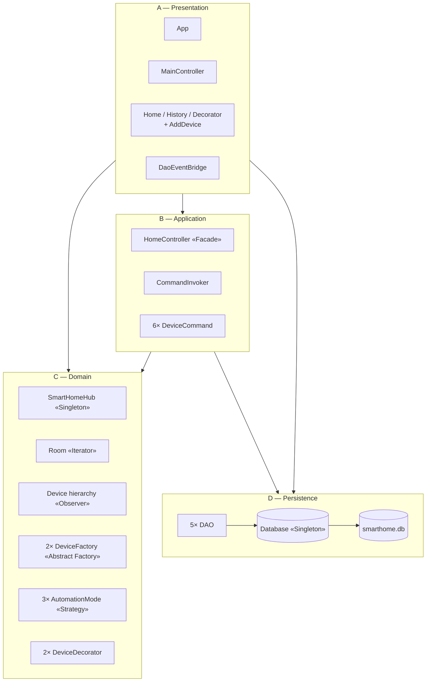
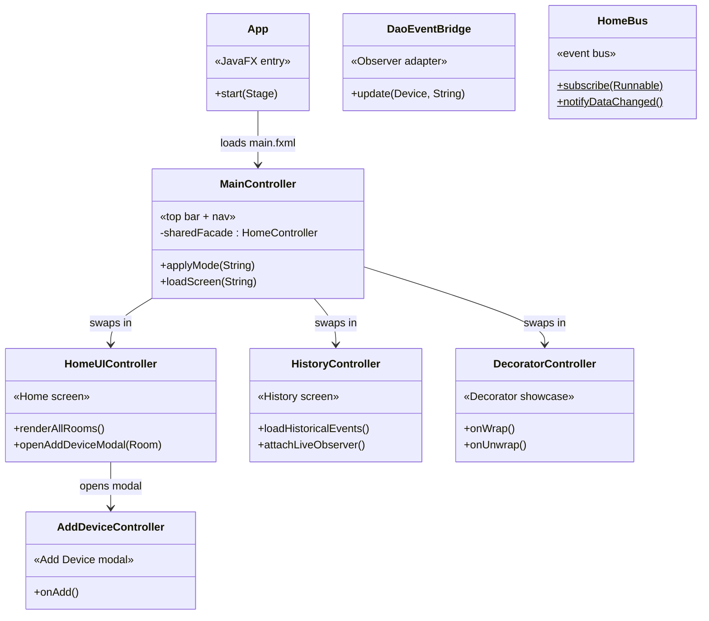
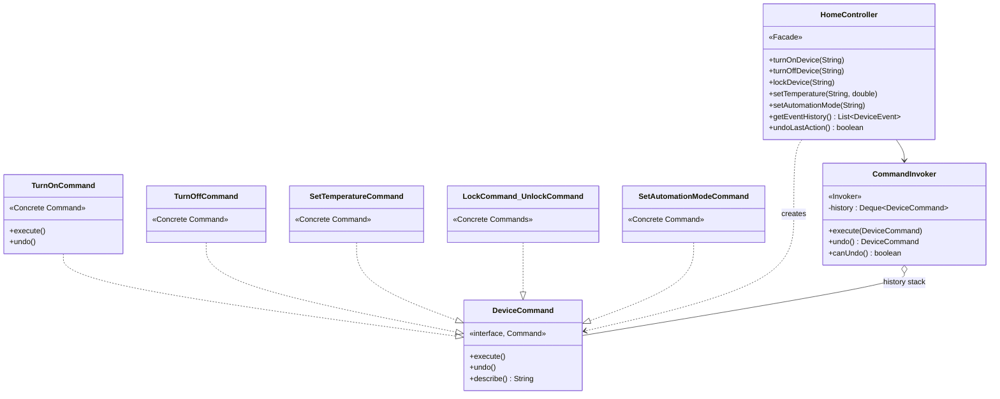
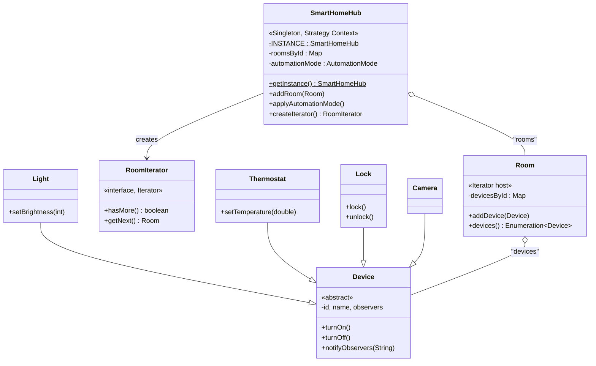
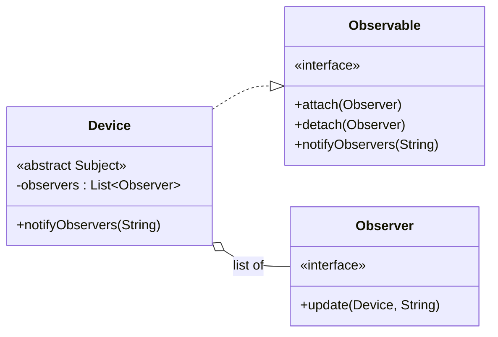
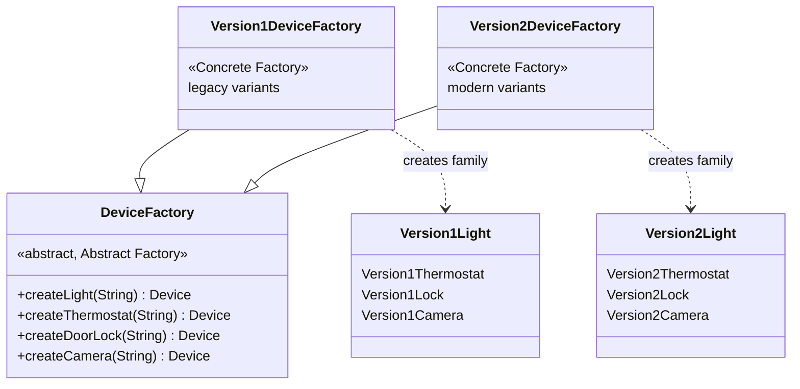
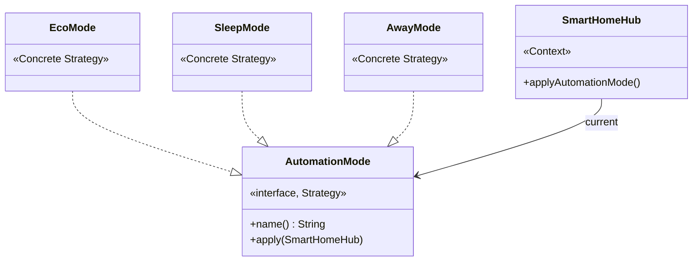
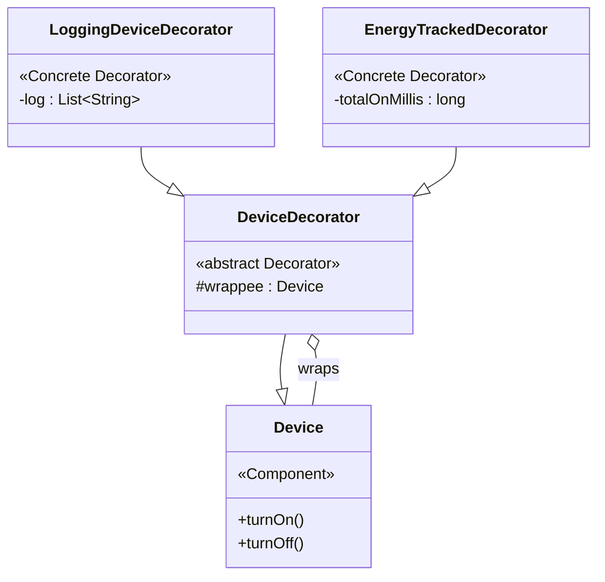
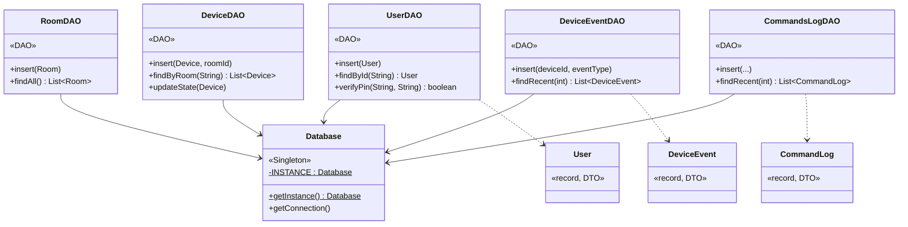

# Smart Home — Class Diagrams (by layer)

The system is organised into **4 layers**: Presentation, Application,
Domain, and Persistence. Each layer below has its own focused class
diagram showing the classes inside it. Cross-layer dependencies are
shown only in the architecture overview at the top — keeping each
per-layer diagram clean of crossing arrows.

> **Viewing this:** GitHub renders Mermaid natively — open
> [this file on github.com](https://github.com/ahmefarouk1234d/smarthome/blob/main/docs/class-diagram.md)
> and every diagram below appears as an SVG.

---

## Table of contents

1. [Architecture overview](#1-architecture-overview)
2. [Layer A — Presentation (JavaFX UI)](#2-layer-a--presentation-javafx-ui)
3. [Layer B — Application (Facade + Command)](#3-layer-b--application-facade--command)
4. [Layer C — Domain (Hub, Devices, Patterns)](#4-layer-c--domain-hub-devices-patterns)
5. [Layer D — Persistence (Database + DAOs)](#5-layer-d--persistence-database--daos)
6. [Putting it together — request flow](#6-putting-it-together--request-flow)

---

## 1. Architecture overview

How the four layers stack and depend on each other. Dependencies flow
downward only — UI never imports DAOs directly.

---

## 2. Layer A — Presentation (JavaFX UI)

The visible application: an `App` that boots JavaFX, a `MainController`
that owns the chrome (top bar, mode picker, status banner, bottom nav),
plus three screen controllers swapped through the central host.
`DaoEventBridge` is a special Observer that lives at the layer boundary
and forwards device events to the Persistence layer.

**Depends on:** Application layer (calls Facade), Persistence layer
(via `DaoEventBridge`).

**Pattern roles in this layer:** `DaoEventBridge` plays the **Observer**
role at the layer boundary. The whole presentation layer demonstrates
the **Facade** rubric line — every controller's mutation path goes
through `HomeController` exclusively.

---

## 3. Layer B — Application (Facade + Command)

The orchestration layer. `HomeController` is the Facade — the single
class the UI calls into. It wraps every mutation in a `DeviceCommand`
and hands it to the `CommandInvoker`, which executes and stores the
command on the undo stack.

**Depends on:** Domain layer (Hub + Device receivers), Persistence layer (DAOs).

**Pattern roles in this layer:** **Facade** (`HomeController`),
**Command** (interface + 6 concretes + `CommandInvoker`). The Invoker
imports only `DeviceCommand` — never any concrete Receiver — which is
RG's litmus test for a correct Command implementation.

---

## 4. Layer C — Domain (Hub, Devices, Patterns)

The pure business model — no JavaFX imports, no SQL imports. Houses
six of the nine patterns: Singleton (Hub), Iterator (Room), Observer
(Device), Abstract Factory (DeviceFactory), Strategy (AutomationMode),
and Decorator (DeviceDecorator).

**Depends on:** *nothing higher in the stack*. The Domain is reusable in
isolation.

### 4.1 Core entities — Hub, Room, Device

### 4.2 Observer — Device as Subject

### 4.3 Abstract Factory — two device families

### 4.4 Strategy — automation modes

### 4.5 Decorator — wrapping devices

---

## 5. Layer D — Persistence (Database + DAOs)

SQL isolation. The `Database` is a Singleton holding the JDBC connection;
each DAO wraps a single table behind plain Java methods. The Domain layer
never sees JDBC.

**Depends on:** Domain (`Device`, `Room` as method args) and Factory
(DeviceDAO uses Abstract Factory at deserialization).

**Pattern roles in this layer:** **Singleton** (Database) and **DAO**
(5 DAOs). `DeviceDAO` also uses the Domain's Abstract Factory at
deserialization to round-trip polymorphic device subtypes.

---

## 6. Putting it together — request flow

How a single user gesture flows across all four layers, exercising six
patterns in one trip.

Patterns visible in this single flow:
- **Facade** — UI calls only `HomeController`
- **Command** — every action becomes a `TurnOnCommand` object
- **Receiver** (Command) — `Device` does the actual work
- **Observer** — `notifyObservers` fans out to UI and DAO
- **DAO** — `DeviceEventDAO.insert` writes to SQLite
- **Singleton** — `HomeController` reaches `SmartHomeHub.getInstance()` to find the device

---

## Pattern roles by layer at a glance

| Layer | Patterns it owns |
|---|---|
| **A — Presentation** | Observer (`DaoEventBridge` at the boundary) |
| **B — Application** | Facade · Command |
| **C — Domain** | Singleton · Iterator · Observer · Abstract Factory · Strategy · Decorator |
| **D — Persistence** | Singleton · DAO |
| **All 9** | spread across A/B/C/D — but the Domain layer is the heart |
