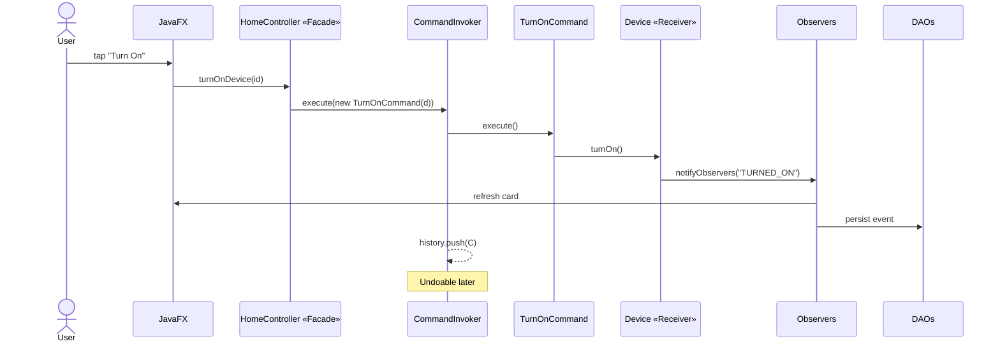

# Smart Home — Class Diagram

One consolidated diagram showing every implemented design pattern. To
keep it readable, repetitive concrete classes are represented by a
single example per family (e.g. one `EcoMode` stands in for
`EcoMode/SleepMode/AwayMode`). Notes call out the omitted siblings.

> **Viewing this:** GitHub renders Mermaid natively — open
> [this file on github.com](https://github.com/ahmefarouk1234d/smarthome/blob/main/docs/class-diagram.md)
> and the diagram below appears as an SVG. For the printed report,
> use [`class-diagram.puml`](class-diagram.puml) at higher resolution.

---

## The diagram

```mermaid
classDiagram
    direction TB

    %% ───────── Singleton role ─────────
    class SmartHomeHub {
        «Singleton, Context»
        -INSTANCE : SmartHomeHub$
        +getInstance() SmartHomeHub$
        +addRoom(Room)
        +setAutomationMode(AutomationMode)
        +applyAutomationMode()
        +createIterator() RoomIterator
    }

    class Database {
        «Singleton»
        +getInstance() Database$
        +getConnection()
    }

    %% ───────── Iterator role ─────────
    class Room {
        «Iterator host»
        -devicesById : Map
        +addDevice(Device)
        +devices() Enumeration~Device~
    }

    class RoomIterator {
        «interface, Iterator»
        +hasMore() boolean
        +getNext() Room
    }

    %% ───────── Observer roles ─────────
    class Observer {
        «interface»
        +update(Device, String)
    }

    class Observable {
        «interface»
        +attach(Observer)
        +detach(Observer)
        +notifyObservers(String)
    }

    %% ───────── Device hierarchy (Component, Receiver) ─────────
    class Device {
        «abstract, Component, Receiver»
        -id, name, observers
        +turnOn()
        +turnOff()
        +isPoweredOn() boolean
        +notifyObservers(String)
    }

    class Light {
        +setBrightness(int)
    }
    class Thermostat {
        +setTemperature(double)
    }

    %% ───────── Abstract Factory ─────────
    class DeviceFactory {
        «abstract, Abstract Factory»
        +createLight(String) Device
        +createThermostat(String) Device
        +createDoorLock(String) Device
        +createCamera(String) Device
    }

    class Version2DeviceFactory {
        «Concrete Factory»
    }

    %% ───────── Strategy ─────────
    class AutomationMode {
        «interface, Strategy»
        +name() String
        +apply(SmartHomeHub)
    }

    class EcoMode {
        «Concrete Strategy»
    }

    %% ───────── Command ─────────
    class DeviceCommand {
        «interface, Command»
        +execute()
        +undo()
        +describe() String
    }

    class TurnOnCommand {
        «Concrete Command»
    }

    class CommandInvoker {
        «Invoker»
        -history : Deque~DeviceCommand~
        +execute(DeviceCommand)
        +undo() DeviceCommand
        +canUndo() boolean
    }

    %% ───────── Decorator ─────────
    class DeviceDecorator {
        «abstract, Decorator»
        #wrappee : Device
    }

    class LoggingDeviceDecorator {
        «Concrete Decorator»
        -log : List~String~
    }

    %% ───────── DAO ─────────
    class DeviceDAO {
        «DAO»
        +insert(Device, roomId)
        +findByRoom(String) List~Device~
        +updateState(Device)
    }

    %% ───────── Facade ─────────
    class HomeController {
        «Facade»
        +turnOnDevice(String)
        +turnOffDevice(String)
        +setAutomationMode(String)
        +getDevicesForRoom(String)
        +getEventHistory()
        +undoLastAction() boolean
    }

    %% ───────── Boundary adapter ─────────
    class DaoEventBridge {
        «Observer adapter»
        +update(Device, String)
    }

    %% ────── Inheritance / realization ──────
    Light --|> Device
    Thermostat --|> Device
    DeviceDecorator --|> Device
    LoggingDeviceDecorator --|> DeviceDecorator
    Version2DeviceFactory --|> DeviceFactory
    EcoMode ..|> AutomationMode
    TurnOnCommand ..|> DeviceCommand
    Device ..|> Observable
    DaoEventBridge ..|> Observer

    %% ────── Composition / aggregation ──────
    SmartHomeHub o-- Room : "rooms"
    Room o-- Device : "devices"
    Device o-- Observer : "observers"
    DeviceDecorator o-- Device : "wraps"
    SmartHomeHub --> AutomationMode : "current strategy"
    SmartHomeHub --> RoomIterator : "creates"
    CommandInvoker o-- DeviceCommand : "history stack"
    TurnOnCommand --> Device : "receiver"

    %% ────── Cross-layer dependencies ──────
    HomeController --> SmartHomeHub
    HomeController --> CommandInvoker
    HomeController --> DeviceDAO
    DeviceDAO --> Database
    DeviceDAO ..> DeviceFactory : "reconstructs via"
    DaoEventBridge --> DeviceDAO

    %% ────── Notes calling out omitted siblings ──────
    note for Light "+ Lock\n+ Camera\n(same pattern)"
    note for Version2DeviceFactory "+ Version1DeviceFactory"
    note for EcoMode "+ SleepMode\n+ AwayMode"
    note for TurnOnCommand "+ TurnOffCommand\n+ SetTemperatureCommand\n+ LockCommand\n+ UnlockCommand\n+ SetAutomationModeCommand"
    note for LoggingDeviceDecorator "+ EnergyTrackedDecorator"
    note for DeviceDAO "+ UserDAO\n+ RoomDAO\n+ DeviceEventDAO\n+ CommandsLogDAO"
```

---

## Reading the diagram

The 9 patterns mapped to roles in the diagram:

| Pattern | Role | Class on the diagram |
|---|---|---|
| **Singleton** | The lone instance | `SmartHomeHub`, `Database` |
| **Iterator** | Aggregate + Iterator | `Room` (returns `Enumeration<Device>`); `RoomIterator` interface; `HubRoomIterator` (omitted, see code) |
| **Observer** | Subject + Observer | `Device` implements `Observable`; `DaoEventBridge` and UI controllers implement `Observer` |
| **Abstract Factory + Factory Methods** | Abstract + concrete families | `DeviceFactory`; `Version2DeviceFactory` shown, `Version1DeviceFactory` noted |
| **Strategy** | Strategy + concretes + Context | `AutomationMode` interface; `EcoMode` shown (`+SleepMode +AwayMode` noted); `SmartHomeHub` is the Context |
| **Command** | Command + Concretes + Invoker + Receiver | `DeviceCommand`; `TurnOnCommand` shown (5 more noted); `CommandInvoker`; `Device` is the Receiver |
| **Decorator** | Component + Base + Concretes | `Device` (Component); `DeviceDecorator` (Base); `LoggingDeviceDecorator` shown (`+EnergyTrackedDecorator` noted) |
| **DAO** | Persistence isolation | `DeviceDAO` shown (4 more noted); all DAOs depend on `Database` |
| **Facade** | Single entry point for the UI | `HomeController` |

---

## Why these classes were chosen

**Each shown class plays a unique pattern role.** Showing `TurnOffCommand`
in addition to `TurnOnCommand` would teach nothing new — both implement
`DeviceCommand` identically. So one representative + a note documenting
the rest keeps the diagram dense in *information*, not boxes.

The diagram covers:
- **2 Singletons** (Hub, Database) — different responsibilities
- **2 different Iterator implementations** (`Enumeration` and custom `RoomIterator`)
- **The Decorator stack** (Component → BaseDecorator → ConcreteDecorator)
- **The Command roundtrip** (Invoker → Command → Receiver)
- **The Abstract Factory family** (Abstract Factory → Concrete Factory → Product)
- **The Facade chokepoint** between UI and the rest of the system
- **The DAO + Database singleton coupling** for persistence

Each of these is a separately testable, separately-graded pattern role.

---

## How a single user action exercises 6 patterns

A "tap Turn On" gesture flows through the system like this. **Same diagram,
different colour for each call** — but expressed as a sequence diagram for
clarity:

Patterns visible in this single flow: **Facade · Command · Receiver · Observer · DAO · Singleton** (UI calls `SmartHomeHub.getInstance()` indirectly through the Facade).
