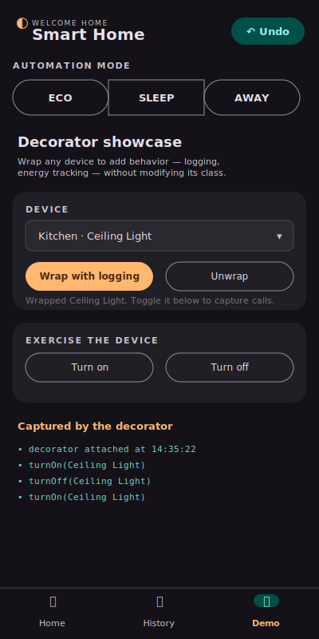

# Smart Home Automation — Design Report

**CSE3202 / SE 491 — 12th Project Assessment** &nbsp;·&nbsp; **Submission: May 8, 2026**
**Repository:** https://github.com/ahmefarouk1234d/smarthome

> **Option 2** — per-pattern diagrams stay in the main report but
> shrink to thumbnails in a grid (one-line caption each). Total
> document targets the 5-page rubric limit.

---

## 1. Project Description

A simplified **Smart Home Automation System** in Java. The user
navigates rooms, controls devices (lights, thermostats, locks, cameras),
applies whole-home automation modes, views past events, and undoes
recent actions through an intuitive JavaFX UI.

**Users can:** list rooms · enter a room and view its devices · turn
devices on/off · lock/unlock doors · adjust thermostat temperature ·
apply automation modes (Eco/Sleep/Away) · add new devices · wrap a
device with a logging decorator · view persisted device events · undo
the most recent action · receive real-time state-change notifications.

---

## 2. Class Descriptions

`SmartHomeHub` — Singleton + Strategy Context + Iterator aggregate.
**Methods:** `getInstance()`, `addRoom`, `getRooms`,
`enumerateRooms() : Enumeration<Room>`, `setAutomationMode`,
`applyAutomationMode()`, `createIterator() : RoomIterator`.

`Room` — Iterator host. **Methods:** `addDevice`, `getDevice`,
`devices() : List<Device>`, `enumerateDevices() : Enumeration<Device>`.

`Device` (abstract) — Subject (Observer), Receiver (Command), Component
(Decorator). **Methods:** `turnOn`, `turnOff`, `attach`, `detach`,
`notifyObservers`. Concretes: `Light`, `Thermostat`, `Lock`, `Camera`,
each with `Version1*`/`Version2*` variants.

`DeviceFactory` (abstract) — Abstract Factory with four Factory
Methods. Concretes: `Version1DeviceFactory`, `Version2DeviceFactory`.

`AutomationMode` (interface, Strategy). Methods: `name()`,
`apply(SmartHomeHub)`. Concretes: `EcoMode`, `SleepMode`, `AwayMode`.

`DeviceCommand` (interface). Methods: `execute`, `undo`, `describe`.
Six concretes; `CommandInvoker` runs them and owns the undo stack.

`HomeController` — Facade; the UI's only entry point.

`Database` — Singleton holding the SQLite connection. Five DAOs
(`UserDAO`/`RoomDAO`/`DeviceDAO`/`DeviceEventDAO`/`CommandsLogDAO`)
isolate SQL.

*Full per-class catalogue in `class-catalog.md`.*

---

## 3. Class Diagram and how each component meets the constraints

Full rendered class diagram (PlantUML — every class, all 9 patterns):

  

Per-pattern detail (one diagram per design pattern role — full versions
in `class-diagram.md`):

<table>
  <tr>
    <td align="center"> <b>Domain core</b> Singleton + Iterator + Device hierarchy</td>
    <td align="center"> <b>Observer</b> Device as Subject; push events to listeners</td>
    <td align="center"> <b>Abstract Factory</b> Two device families with Factory Methods</td>
    <td align="center"> <b>Strategy</b> Eco/Sleep/Away with hub as Context</td>
  </tr>
  <tr>
    <td align="center"> <b>Decorator</b> Stackable wrappers around Device</td>
    <td align="center"> <b>Facade + Command</b> HomeController wraps every action</td>
    <td align="center"> <b>Presentation</b> App, controllers, DaoEventBridge</td>
    <td align="center" style="font-size:small;color:#5a6478">DAO and Singleton (Database) visible in the full diagram above. See <code>class-diagram.md</code> for the complete per-layer set + sequence diagram.</td>
  </tr>
</table>

- **Modularity & ease of expansion** — patterns isolate concerns by
  package; new modes / factories / commands plug in by adding one class
  (Open–Closed Principle).
- **Prevent invalid/unsafe operations** — null guards, type-checked
  Facade rejects, idempotent state changes, Command pre-state for
  reliable undo, `PreparedStatement` everywhere.
- **Intuitive accessible GUI** — mobile-styled 400×800 window; 48 px tap
  targets; WCAG AAA contrast; confirmation dialogs before destructive
  actions.

---

## 4. Implementation of Design Patterns (9 total)

| # | Pattern | Where it lives | Required methods |
|---|---|---|---|
| 1 | **Singleton** | `core.SmartHomeHub`, `persistence.Database` | `getInstance()`, private constructor |
| 2 | **Iterator** | `Room.enumerateDevices()`, `SmartHomeHub.enumerateRooms()`, `core.RoomIterator` | `enumerateDevices() : Enumeration<Device>`, `enumerateRooms() : Enumeration<Room>`, `hasMore`, `getNext` |
| 3 | **Observer** | `observer.Observer/Observable`, `devices.Device` | `attach`, `detach`, `notifyObservers(String)`, `update(Device, String)` |
| 4 | **Abstract Factory + Factory Methods** | `factory.DeviceFactory` + `Version1/Version2DeviceFactory` | `createLight`, `createThermostat`, `createDoorLock`, `createCamera` |
| 5 | **Strategy** | `strategy.AutomationMode` + 3 modes; hub is Context | `name()`, `apply(SmartHomeHub)` |
| 6 | **Command** | `command.DeviceCommand` + 6 concretes; `CommandInvoker` | `execute`, `undo`, `describe`; `CommandInvoker.execute/undo/canUndo` |
| 7 | **Decorator** | `devices.decorator.DeviceDecorator` + 2 wrappers | `wrappee` field; overridden `turnOn/turnOff` |
| 8 | **DAO** | `persistence.dao.*` (5 DAOs) | `insert`, `findById`, `findByRoom`, `findRecent` |
| 9 | **Facade** | `facade.HomeController` | `turnOnDevice`, `setAutomationMode`, `getEventHistory`, `undoLastAction`, … |

**Justifications.** *Singleton*: hub and database are global state.
*Iterator*: `Enumeration` per the brief, plus a custom GoF
`RoomIterator`. *Observer* (push): devices push events to UI, history,
and `DaoEventBridge`. *Abstract Factory*: two coordinated families,
every factory implements every method. *Strategy*: hub holds the
active mode; new modes plug in without editing hub code. *Command*:
every action is an object with reliable undo; Invoker imports zero
domain classes. *Decorator*: stackable wrappers add behaviour without
modifying any device class. *DAO*: SQL isolated behind plain Java APIs.
*Facade*: single UI entry point.

---

## 5. Alternative Designs and Trade-Off Analysis

### 5.1 Observer Push vs. Pull

| Aspect | Push (chosen) | Pull |
|---|---|---|
| Notify signature | `update(Device d, String event)` | `update(Device d)` |
| **Performance** | Lower latency | Round-trip required |
| **Extensibility** | New fields force observer changes | Zero-cost field additions |
| **Cost** | Larger payload | Smaller notify payload |
| **Maintainability** | Simple observers | Subject coupling |

*Justification:* small fixed event vocabulary makes the push payload
tiny; lower UI-refresh latency; trivial `DaoEventBridge`.

### 5.2 Abstract Factory by family vs. Factory Method per type

| Aspect | Factory Method per type | Abstract Factory by family (chosen) |
|---|---|---|
| Class layout | One factory per device type | Abstract + 2 concrete families |
| Rubric phrasing | Partial | Full — *"Abstract Factory with Factory Methods"* |
| **Extensibility** | Cheap new types | Cheap new families |
| **Cost (LOC)** | Lower | Slightly higher |
| **Maintainability** | Per-factory cohesion | Family cohesion |

*Justification:* the brief demands "Abstract Factory **with** Factory
Methods"; we rejected an earlier "Comfort vs Security" axis (LSP
violation) for the Version1/Version2 generations where every factory
implements every method meaningfully.

---

## 6. Constraints Satisfied

| Constraint | How |
|---|---|
| **Modularity & expansion** | Patterns + per-package boundaries; new modes/factories/commands plug in by adding one class. |
| **Prevent invalid/unsafe ops** | Null guards, type-checked Facade rejects, idempotent state changes, Command pre-state for undo, prepared SQL. |
| **Intuitive accessible GUI** | Mobile-styled, 48 px tap targets, WCAG AAA contrast, mode-change confirmation dialogs, observer-driven live refresh. |

---

## 7. Screenshots — GUI in action

<table>
  <tr>
    <td align="center"> <b>Home</b></td>
    <td align="center"> <b>Mode confirm</b></td>
    <td align="center"> <b>History</b></td>
    <td align="center"> <b>Decorator</b></td>
    <td align="center"> <b>Add device</b></td>
  </tr>
</table>

---

## 8. References

- Refactoring Guru — pattern reference structures (https://refactoring.guru/design-patterns)
- Gamma, Helm, Johnson, Vlissides — *Design Patterns: Elements of Reusable Object-Oriented Software*
- Sun / Oracle Core J2EE Patterns — DAO definition

*Companion documents: `class-diagram.md`, `class-catalog.md`.*
