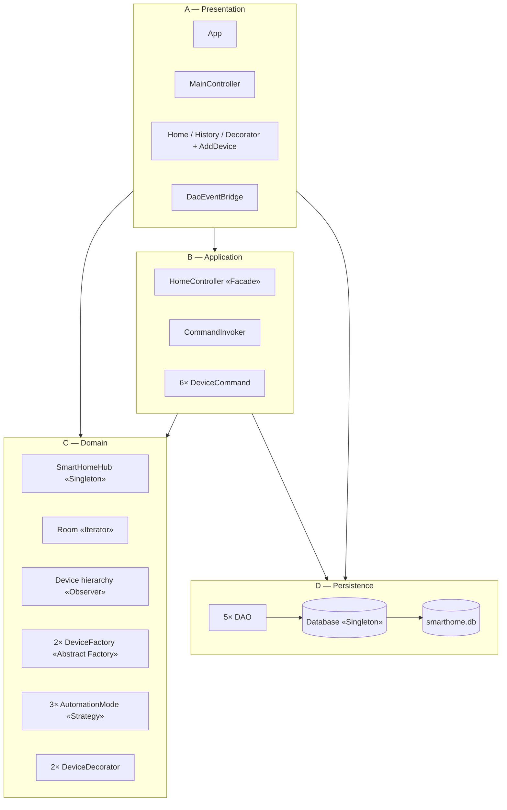
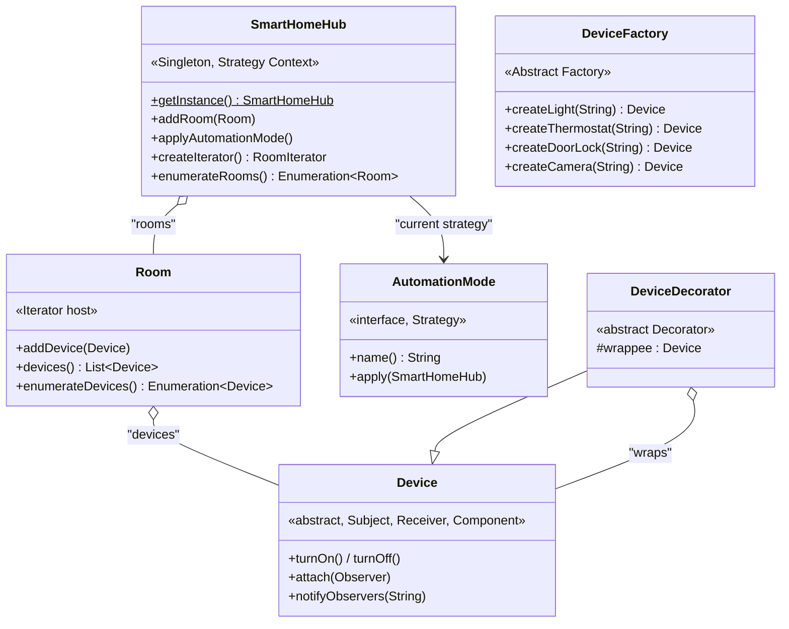

# Smart Home Automation — Design Report

**CSE3202 / SE 491: Software Component Design** &nbsp;·&nbsp; **12th Project Assessment**
**Submission date:** May 8, 2026

---

## Project Description

In this project, we implement a simplified version of a **Smart Home
Automation System** in Java. The system allows users to interact with
their home, navigate rooms, control individual devices (lights,
thermostats, locks, cameras), apply whole-home automation modes, view
event history, and undo recent actions — while also discovering the
world of design patterns!

### Users can

- Get a list of all rooms in the home
- Enter a room and view its devices
- Turn devices on or off; lock or unlock doors
- Adjust thermostat temperatures
- Apply automation modes (Eco, Sleep, Away) to the whole home
- Add new devices to a room (selecting type and family)
- Wrap a device with a logging decorator and view captured calls
- View past device events (persisted across application restarts)
- View command history with descriptions and undo the most recent action
- Receive real-time notifications when devices change state

---

## Here's a brief description of each class

### `SmartHomeHub`

Represents the smart home itself. The hub is responsible for owning the
set of rooms, holding the currently active automation mode, and
coordinating cross-cutting access to the domain model. Implemented as a
**thread-safe Singleton** so the whole application sees one
authoritative state.

**Notable Attributes**
- `INSTANCE` — the lone static instance of the hub
- `roomsById` — a collection of `Room` objects, indexed by id
- `automationMode` — the currently active `AutomationMode` strategy

**Possible Methods**
- `static SmartHomeHub getInstance()` — Singleton accessor
- `void addRoom(Room r)` — register a room with the hub
- `Room getRoom(String roomId)` — find a room by id
- `Collection<Room> getRooms()` — read-only view of all rooms
- `Enumeration<Room> enumerateRooms()` — Iterator-pattern method (returns Enumeration)
- `void setAutomationMode(AutomationMode mode)` — install a Strategy
- `void applyAutomationMode()` — Context delegate that runs the active strategy
- `RoomIterator createIterator()` — Iterator-pattern factory method (custom GoF interface)

### `Room`

Represents a logical room inside the home (Kitchen, Living Room, Front
Door). Each room contains a collection of devices and exposes them via
the **Iterator pattern** as both an `Enumeration<Device>` (rubric
requirement) and a modern `List<Device>`.

**Notable Attributes**
- `roomId` — unique room id
- `name` — human-readable name
- `devicesById` — devices in this room, indexed by id

**Possible Methods**
- `String getRoomId()` / `String getName()`
- `void addDevice(Device d)` — register a device with this room
- `void removeDevice(String deviceId)`
- `Device getDevice(String deviceId)`
- `List<Device> devices()` — modern accessor returning a snapshot list
- `Enumeration<Device> enumerateDevices()` — Iterator-pattern method (returns Enumeration)

### `Device`

Abstract superclass representing any controllable thing in the home.
Plays three pattern roles: **Subject** (Observer), **Receiver**
(Command), **Component** (Decorator). Every state-changing method calls
`notifyObservers(event)` to push the change to every listener.

**Notable Attributes**
- `id` — UUID, immutable, set at construction
- `name` — display name
- `poweredOn` — current power state
- `observers` — list of `Observer` instances attached to this device

**Possible Methods**
- `String getId()` / `String getName()` / `boolean isPoweredOn()`
- `void turnOn()` — fires `TURNED_ON` event
- `void turnOff()` — fires `TURNED_OFF` event
- `void attach(Observer o)` / `void detach(Observer o)` — Observable contract
- `void notifyObservers(String event)` — push an event to every listener

### `Light` / `Thermostat` / `Lock` / `Camera`

Concrete subclasses of `Device`. Each adds type-specific state and
behaviour:

- **`Light`** — `brightness : int`; `setBrightness(int)` fires `BRIGHTNESS_CHANGED`
- **`Thermostat`** — `temperature : double`; `setTemperature(double)` fires `TEMP_CHANGED`
- **`Lock`** — `locked : boolean`; `lock()` / `unlock()` fire `LOCKED` / `UNLOCKED`
- **`Camera`** — uses inherited `turnOn` / `turnOff` to represent armed / disarmed

Each base class has two family variants (`Version1*`, `Version2*`)
produced by the corresponding concrete `DeviceFactory`. Variants differ
in policy — e.g. `Version1Light.setBrightness` snaps to 25 % steps
while `Version2Light` accepts any 0–100 value.

### `DeviceFactory`

Abstract superclass declaring the family of device-creation methods.
This is the **Abstract Factory** half of the rubric line *"Abstract
Factory with Factory Methods"* — each `createXxx(String)` is a
**Factory Method** subclasses override.

**Possible Methods**
- `abstract Device createLight(String name)` — Factory Method
- `abstract Device createThermostat(String name)` — Factory Method
- `abstract Device createDoorLock(String name)` — Factory Method
- `abstract Device createCamera(String name)` — Factory Method
- `protected String newId()` — UUID generator for new devices

`Version1DeviceFactory` and `Version2DeviceFactory` are concrete
subclasses, each implementing all four factory methods to return its
family's variants — both are Liskov-substitutable for `DeviceFactory`.

### `AutomationMode` (and `EcoMode` / `SleepMode` / `AwayMode`)

The **Strategy** interface for whole-home automation behaviour. Each
concrete strategy walks all rooms via the Iterator and mutates devices
according to its policy.

**Possible Methods**
- `String name()` — UI-displayable mode name
- `void apply(SmartHomeHub hub)` — runs the strategy's algorithm

Concrete strategies differ in policy: `EcoMode` sets thermostats to
24 °C and dims powered-on lights to 50 %; `SleepMode` turns off lights,
locks doors, and lowers thermostats to 20 °C; `AwayMode` additionally
arms cameras and lowers thermostats to 15 °C.

### `DeviceCommand` and `CommandInvoker`

The **Command** pattern: every user action becomes a `DeviceCommand`
object that holds a Receiver and captures pre-execute state for reliable
`undo()`.

**`DeviceCommand` Possible Methods**
- `void execute()` — perform the action
- `void undo()` — restore pre-execute state
- `String describe()` — human-readable label for command-history UI

Six concrete commands exist: `TurnOnCommand`, `TurnOffCommand`,
`SetTemperatureCommand`, `LockCommand`, `UnlockCommand`,
`SetAutomationModeCommand`. The `CommandInvoker` runs commands and
maintains the undo stack via `execute()`, `canUndo()`, `undo()`.

### `HomeController` (the **Facade**)

The single class the JavaFX UI talks to. Wraps every mutation in a
`DeviceCommand` and delegates to `CommandInvoker`. Read methods route
through DAOs. Pure orchestration — no domain logic.

**Possible Methods**
- `void turnOnDevice(String deviceId)` / `void turnOffDevice(String deviceId)`
- `void lockDevice(String deviceId)` / `void unlockDevice(String deviceId)`
- `void setTemperature(String deviceId, double value)`
- `void setAutomationMode(String modeName)`
- `List<Device> getDevicesForRoom(String roomId)`
- `List<DeviceEvent> getEventHistory()` / `List<CommandLog> getCommandHistory()`
- `boolean undoLastAction()` — exposes Command undo to the UI

A complete per-class catalogue (including `Database`, the 5 DAO
classes, `Observer/Observable`, the decorator hierarchy, and UI
controllers) is provided in the companion document **`class-catalog.md`**.

---

## Class Diagram and how each component meets the system requirements

The system is organised into **four layers**, each depending only on
layers below it. Per-layer detailed diagrams (with all classes inside
each layer) and a sequence diagram showing patterns collaborating are
in the companion document **`class-diagram.md`**.

### Architecture overview

### Domain layer (where 6 of 9 patterns live)

For the full per-class layer diagrams (Presentation, Application,
Domain, Persistence) and the cross-layer sequence diagram, see
**`class-diagram.md`** in the repository.

How each layer contributes:

- **Modularity & ease of expansion** — each pattern lives in its own
  package; new modes (Strategy), new device families (Abstract Factory),
  or new commands (Command) plug in by adding one class with zero edits
  to existing classes (Open–Closed Principle).
- **Prevent invalid/unsafe operations** — every public method validates
  inputs (`Objects.requireNonNull`, type-checked downcasts in the
  Facade, factory UUID deduplication). Mode-change requests show a
  confirmation dialog before applying. Every command captures pre-state
  so `undo()` can restore the home to a known-good configuration.
- **Intuitive accessible GUI** — a mobile-styled 400×800 window with
  large 48 px tap targets, dark slate background and high-contrast
  amber accents (8.4 : 1 contrast — WCAG AAA). All state badges combine
  colour with text/icons so the interface remains usable for
  colour-blind users.

---

## Implementation of Design Patterns

The project implements **9 design patterns**, including the 4 mandated
by the brief plus 5 additional patterns chosen to satisfy specific
project constraints.

| # | Pattern | Where it lives | Required methods |
|---|---|---|---|
| 1 | Singleton | `core.SmartHomeHub`, `persistence.Database` | `getInstance()`, private constructor |
| 2 | Iterator | `core.Room.enumerateDevices()`, `core.SmartHomeHub.enumerateRooms()`, `core.RoomIterator` | `enumerateDevices() : Enumeration<Device>`, `enumerateRooms() : Enumeration<Room>`; `hasMore()`, `getNext()` |
| 3 | Observer | `observer.Observer/Observable`, `devices.Device` | `attach`, `detach`, `notifyObservers`, `update(Device, String)` |
| 4 | Abstract Factory + Factory Methods | `factory.DeviceFactory` + `Version1/Version2DeviceFactory` | `createLight`, `createThermostat`, `createDoorLock`, `createCamera` |
| 5 | Strategy | `strategy.AutomationMode` + 3 modes; `SmartHomeHub` is the Context | `name()`, `apply(SmartHomeHub)` |
| 6 | Command | `command.DeviceCommand` + 6 concretes; `CommandInvoker` | `execute()`, `undo()`, `describe()`; `CommandInvoker.execute()`, `undo()` |
| 7 | Decorator | `devices.decorator.DeviceDecorator` + 2 wrappers | `wrappee` field; overridden `turnOn / turnOff` etc. |
| 8 | DAO | `persistence.dao.*` — 5 DAOs | `insert`, `findById`, `findByRoom`, `findRecent` |
| 9 | Facade | `facade.HomeController` | `turnOnDevice`, `setAutomationMode`, `getEventHistory`, `undoLastAction`, … |

### Justifications

- **Singleton** — `SmartHomeHub` and `Database` are global state by
  nature; multiple instances would cause inconsistent device state and
  competing JDBC connections. Both use eager initialisation, which the
  JVM guarantees thread-safe via class-loading.
- **Iterator** — `Room.enumerateDevices()` and `SmartHomeHub.enumerateRooms()`
  return `java.util.Enumeration` to honour the brief's exact wording
  (mirroring the Airport reference example). A custom `RoomIterator`
  (`hasMore() / getNext()`) at the hub level provides the Gang-of-Four
  shape alongside the Enumeration form.
- **Observer** — devices fire `notifyObservers(event)` after every
  state change, pushing both the affected device and a short event
  string. UI controllers, the history feed, and `DaoEventBridge` all
  attach to the same Observable. This keeps the domain layer unaware
  of UI or persistence concerns.
- **Abstract Factory + Factory Methods** — `DeviceFactory` declares
  four `create…(String name)` Factory Methods. Two concrete factories
  produce two coordinated families (`Version1`, `Version2`). Both
  implement every method meaningfully — the abstraction is
  Liskov-substitutable.
- **Strategy** — three `AutomationMode` implementations encapsulate
  whole-home behaviours. The hub is the Context: it holds the active
  strategy and exposes `applyAutomationMode()` so callers never need
  to know which concrete mode is loaded. Adding a new mode requires
  one new class.
- **Command** — every UI gesture becomes a `DeviceCommand` object.
  Commands hold a Receiver reference and capture pre-state so `undo()`
  is reliable. The `CommandInvoker` owns a history stack and exposes
  `undo()` to the UI. The Invoker imports zero domain classes — the
  litmus test for a correct implementation.
- **Decorator** — `DeviceDecorator` extends `Device` and wraps a
  delegate. `LoggingDeviceDecorator` and `EnergyTrackedDecorator` add
  cross-cutting behaviour without modifying any existing device class,
  satisfying the OCP.
- **DAO** — five DAOs isolate all SQL behind plain Java APIs. The
  domain layer never imports `java.sql`. `DeviceDAO` round-trips
  polymorphic device subtypes by re-using the Abstract Factory at
  deserialization.
- **Facade** — `HomeController` is the only class the UI calls into.
  Every method delegates to the hub, the invoker, or a DAO; no domain
  logic is reimplemented. Keeps the JavaFX layer thin.

---

## Alternative Designs and Trade-Off Analysis

Per the brief, **two alternative designs** with explanation, trade-off
analysis, and justification:

### Observer push model vs. pull model

| Aspect | Push (chosen) | Pull |
|---|---|---|
| Notification signature | `update(Device d, String event)` — full state pushed | `update(Device d)` — observer must call `d.getX()` |
| **Performance** | Lower latency; one method call per change | Slightly higher; observer round-trips back to subject |
| **Extensibility** | New fields require every observer to know about them | New fields are zero-cost; observers fetch what they need |
| **Cost (memory)** | Larger payload at notify time | Smaller notify payload |
| **Maintainability** | Observers stay simple; no back-references | Tighter coupling — observers depend on subject's getters |

**Justification (chose Push):** the small, well-defined event vocabulary
(`TURNED_ON`, `LOCKED`, `TEMP_CHANGED`, etc.) makes the push payload tiny
and stable. Push gives lower latency for the live UI demo and keeps
observers (especially `DaoEventBridge`) trivial.

### Abstract Factory by *family* vs. Factory Method *per type*

| Aspect | Factory Method per type | Abstract Factory by family (chosen) |
|---|---|---|
| Class layout | One factory per device type | One abstract factory + two concrete families |
| Rubric phrasing match | Partial — only Factory Methods | Full — *"Abstract Factory with Factory Methods"* |
| **Performance** | Identical | Identical |
| **Extensibility** | New device type → one new factory class | New family → one new factory class implementing all methods |
| **Cost (LOC)** | Lower per concrete factory | Slightly higher; all factories implement all four methods |
| **Maintainability** | Higher per-factory cohesion | Higher *family* cohesion — products of one factory are guaranteed compatible |

**Justification (chose Abstract Factory by family):** the brief
explicitly asks for "Abstract Factory **with Factory Methods**" — both
roles must be visible. We rejected an earlier "Comfort vs. Security
families" design because it required `UnsupportedOperationException`
stubs (LSP violation) and instead picked a Version1 / Version2
generation axis where every factory implements every method
meaningfully. This produces a real Abstract Factory in the
Refactoring-Guru-canonical sense.

---

## Constraints Satisfied

| Constraint | How the design satisfies it |
|---|---|
| **Modularity & ease of future expansion** | Each pattern lives in its own package; new modes, factories, and commands plug in by adding one class. |
| **Prevent invalid/unsafe operations** | Null-safe constructors; Facade rejects type-mismatched calls; idempotent state changes; Command pre-state capture for reliable undo; PreparedStatement everywhere to prevent SQL injection. |
| **Intuitive accessible GUI** | Mobile-styled 400×800 window; 48 px tap targets; high-contrast palette; mode changes show a confirmation dialog explaining the consequences; status banner narrates every action; observer-driven live refresh so cards update without polling. |

---

## Screenshots — GUI in action

> Screenshots taken at 400×800 (mobile-styled JavaFX window). To
> reproduce: clone the repo and run `./mvnw javafx:run`.

### Home screen — rooms with device cards

The dashboard. Rooms are listed with their devices as cards (icon,
name, family, state badge, contextual action button). Tapping a button
calls a single Facade method, which routes through `CommandInvoker` →
`DeviceCommand` → device → `notifyObservers`.

### Mode picker with confirmation dialog

Tapping ECO/SLEEP/AWAY opens a confirmation dialog explaining the
consequences of the mode change before applying. Demonstrates the
"prevent invalid/unsafe operations" constraint: the user is shown what
will change and given a chance to cancel before bulk device mutations.

### History tab — Observer + DAO live feed

Every device state change fires through the Observer chain to both the
UI's live event log and the SQLite `device_events` table via
`DaoEventBridge`. Closing and reopening the app preserves history —
demonstrating the DAO pattern's persistence contract.

### Decorator showcase

Pick a device, tap "Wrap with Logging", and any subsequent
turn-on/turn-off calls are captured by `LoggingDeviceDecorator` without
modifying the wrapped device's class. Demonstrates the Decorator pattern's
transparent-wrapping contract and the OCP constraint.

### Add Device modal — Abstract Factory at runtime

The user picks a device type (Light/Thermostat/Lock/Camera) and a
family (Version1/Version2). The Facade invokes the corresponding
`DeviceFactory.createXxx(name)` method, persists the device via
`DeviceDAO`, and attaches a `DaoEventBridge` observer — a runtime
demonstration of the **Abstract Factory + Factory Methods** pattern.

---

## References

- Refactoring Guru — pattern reference structures (https://refactoring.guru/design-patterns)
- Gamma, Helm, Johnson, Vlissides — *Design Patterns: Elements of Reusable Object-Oriented Software* (the GoF book)
- Sun / Oracle Core J2EE Patterns — DAO pattern definition
- CSE3202 / SE 491 12th project brief

---

*Companion documents: `class-diagram.md`, `class-catalog.md`. Full
source: https://github.com/ahmefarouk1234d/smarthome*
