# Smart Home Automation — Design Report

**CSE3202 / SE 491 — 12th Project Assessment** &nbsp;·&nbsp; **Submission: May 8, 2026**
**Repository:** https://github.com/ahmefarouk1234d/smarthome

---

## 1. Project Description

A simplified **Smart Home Automation System** in Java. The user navigates
rooms, controls devices (lights, thermostats, locks, cameras), applies
whole-home automation modes, views past events, and undoes recent actions
through an intuitive JavaFX UI.

**Users can:**

- list rooms
- enter a room and view its devices
- turn devices on/off
- lock/unlock doors
- adjust thermostat temperature
- apply automation modes (Eco / Sleep / Away)
- add new devices
- wrap a device with a logging decorator
- view persisted device events
- undo the most recent action
- receive real-time state-change notifications

---

## 2. Class Descriptions

`SmartHomeHub` — Singleton + Strategy Context + Iterator aggregate.
**Attrs:** `INSTANCE`, `roomsById`, `automationMode`.
**Methods:** `getInstance()`, `addRoom(Room)`, `getRoom(String)`,
`getRooms()`, `enumerateRooms() : Enumeration<Room>`, `setAutomationMode`,
`applyAutomationMode()`, `createIterator() : RoomIterator`.

`Room` — Iterator host; aggregates devices.
**Attrs:** `roomId`, `name`, `devicesById`.
**Methods:** `addDevice(Device)`, `removeDevice(String)`, `getDevice(String)`,
`devices() : List<Device>`, `enumerateDevices() : Enumeration<Device>`.

`Device` (abstract) — Subject (Observer), Receiver (Command), Component (Decorator).
**Attrs:** `id`, `name`, `poweredOn`, `observers`.
**Methods:** `turnOn`, `turnOff`, `attach(Observer)`, `detach`, `notifyObservers(String)`.
**Concrete subclasses:** `Light` (`setBrightness(int)`), `Thermostat`
(`setTemperature(double)`), `Lock` (`lock()/unlock()`), `Camera`. Each has
two family variants (`Version1*`, `Version2*`) produced by the
corresponding `DeviceFactory`.

`DeviceFactory` (abstract) — Abstract Factory with four Factory Methods:
`createLight`, `createThermostat`, `createDoorLock`, `createCamera`.
Concrete subclasses: `Version1DeviceFactory`, `Version2DeviceFactory`.

`AutomationMode` (interface) — Strategy. Methods: `name()`, `apply(SmartHomeHub)`.
Concretes: `EcoMode` (24°C, dim 50%), `SleepMode` (off + lock + 20°C),
`AwayMode` (off + lock + arm + 15°C).

`DeviceCommand` (interface) — Command. Methods: `execute()`, `undo()`,
`describe()`. Six concretes (`TurnOn/TurnOff/SetTemperature/Lock/Unlock/SetAutomationMode`).
`CommandInvoker` runs commands and owns the undo stack.

`HomeController` — Facade; the UI's only entry point. Methods:
`turnOnDevice/turnOffDevice/lockDevice/unlockDevice/setTemperature/setAutomationMode/getDevicesForRoom/getEventHistory/getCommandHistory/undoLastAction`.

`Database` — Singleton wrapping the SQLite connection. `getInstance()`,
`getConnection()`. Five DAOs (`UserDAO`, `RoomDAO`, `DeviceDAO`,
`DeviceEventDAO`, `CommandsLogDAO`) isolate SQL.

*A more detailed per-class catalogue is in the companion document
`class-catalog.md`.*

---

## 3. Class Diagram and how each component meets the constraints

Full rendered class diagram (PlantUML — every class, all 9 patterns,
every relationship):

  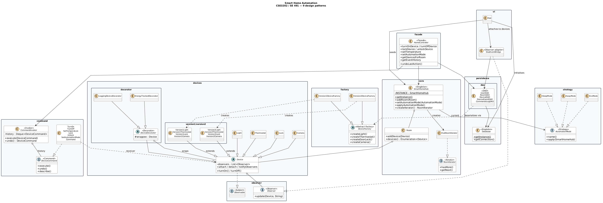

Per-pattern detailed class diagrams follow. Each diagram is shown
side-by-side with its explanation.

### 3.1 Layer A — Presentation (UI)

<table>
<tr>
<td width="58%">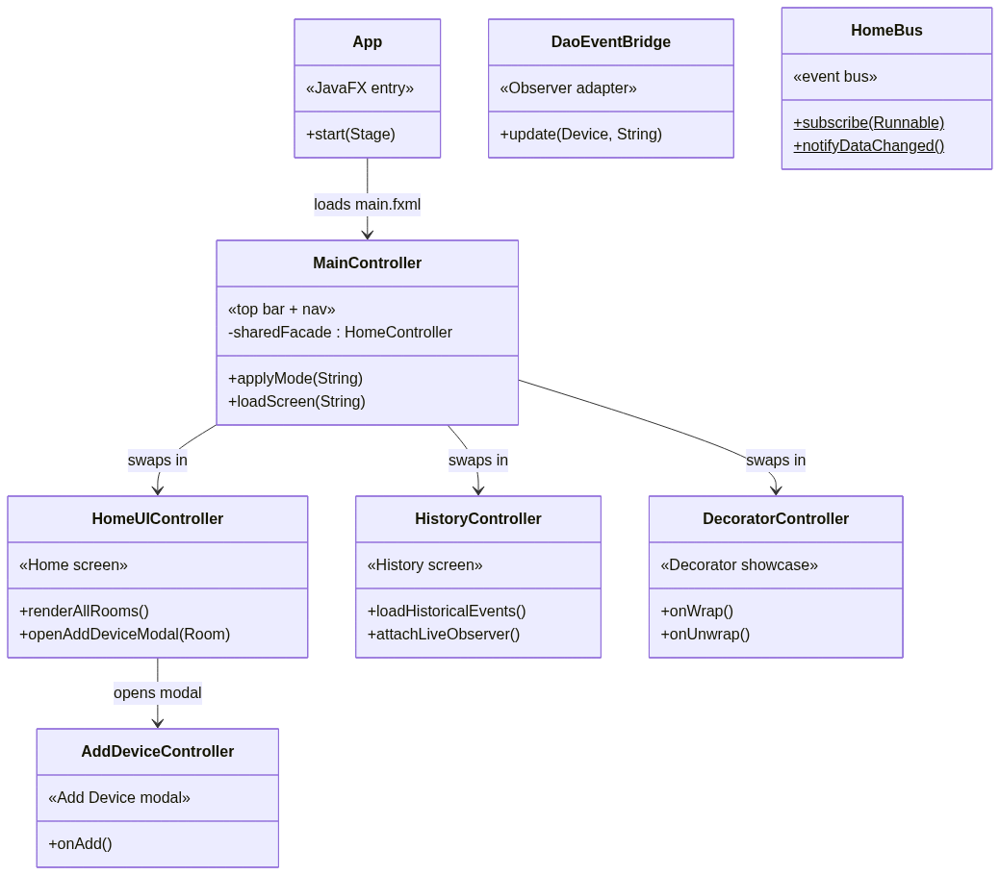</td>
<td>The UI is composed of <code>App</code> (JavaFX entry),
<code>MainController</code> (top bar + nav), three screen controllers
swapped through a central host (<code>HomeUIController</code>,
<code>HistoryController</code>, <code>DecoratorController</code>), the
<code>AddDeviceController</code> modal, and the
<code>DaoEventBridge</code> boundary adapter that forwards device
events to the persistence layer.</td>
</tr>
</table>

### 3.2 Layer B — Application (Facade + Command)

<table>
<tr>
<td width="58%">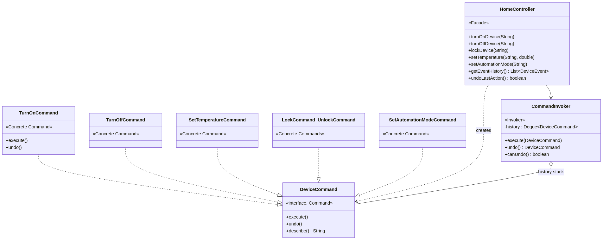</td>
<td><code>HomeController</code> (Facade) is the only class the UI calls.
Each mutation routes through <code>CommandInvoker</code>, which executes
a concrete <code>DeviceCommand</code> (six exist:
<code>TurnOn / TurnOff / SetTemperature / Lock / Unlock /
SetAutomationMode</code>) and pushes it onto the undo stack. The Invoker
imports zero domain classes — only <code>DeviceCommand</code>.</td>
</tr>
</table>

### 3.3 Domain core — Singleton + Iterator + base devices

<table>
<tr>
<td width="58%">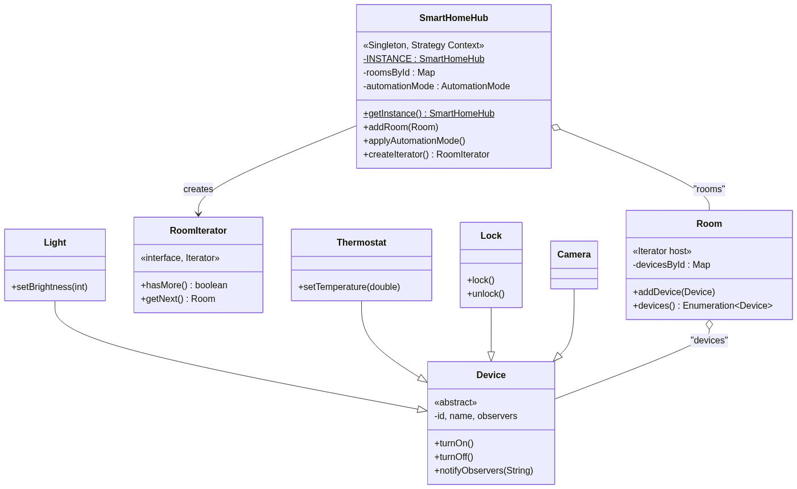</td>
<td><code>SmartHomeHub</code> (Singleton + Strategy Context) owns the
rooms. <code>Room</code> is the Iterator host —
<code>enumerateDevices()</code> returns <code>Enumeration&lt;Device&gt;</code>
per the rubric line. <code>RoomIterator</code> provides the custom GoF
Iterator interface (<code>hasMore()</code>, <code>getNext()</code>).</td>
</tr>
</table>

### 3.4 Observer — Device as Subject

<table>
<tr>
<td width="50%">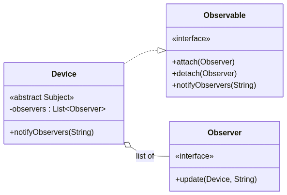</td>
<td><code>Device</code> implements <code>Observable</code>; observers
attach via <code>attach(Observer)</code> and receive
<code>update(Device, String)</code> calls when state changes. UI
controllers, history feeds, and <code>DaoEventBridge</code> are all
observers — each independent of the others.</td>
</tr>
</table>

### 3.5 Abstract Factory — two device families

<table>
<tr>
<td width="58%">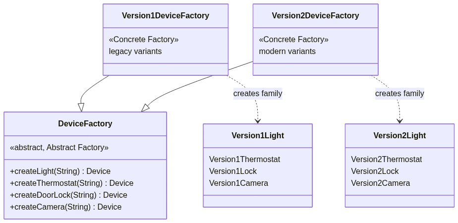</td>
<td><code>DeviceFactory</code> declares four Factory Methods
(<code>createLight</code>, <code>createThermostat</code>,
<code>createDoorLock</code>, <code>createCamera</code>).
<code>Version1DeviceFactory</code> and <code>Version2DeviceFactory</code>
each implement all four methods, returning their family's variants —
Liskov-substitutable, no <code>UnsupportedOperationException</code> stubs.</td>
</tr>
</table>

### 3.6 Strategy — automation modes

<table>
<tr>
<td width="58%">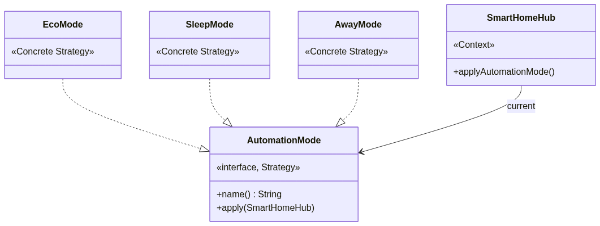</td>
<td><code>AutomationMode</code> is the Strategy interface.
<code>EcoMode</code>, <code>SleepMode</code>, and <code>AwayMode</code>
are concrete strategies. <code>SmartHomeHub</code> is the Context — it
holds the active strategy and exposes
<code>applyAutomationMode()</code> so callers never need to know which
concrete mode is loaded.</td>
</tr>
</table>

### 3.7 Decorator — wrapping devices

<table>
<tr>
<td width="58%">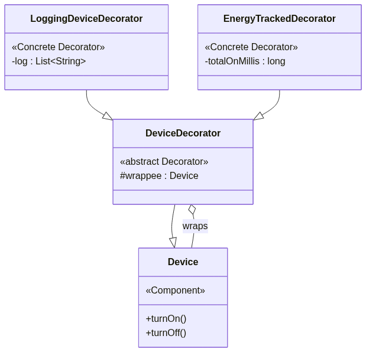</td>
<td><code>DeviceDecorator</code> wraps a <code>Device</code> (the
Component) and forwards every method to it.
<code>LoggingDeviceDecorator</code> and
<code>EnergyTrackedDecorator</code> override individual methods to add
cross-cutting behaviour (logging, energy tracking) without modifying any
device class.</td>
</tr>
</table>

### How each component meets the constraints

Dependencies flow downward only — UI never imports DAOs directly; the
Domain layer is self-contained and reusable in isolation.

- **Modularity & ease of expansion** — each pattern lives in its own
  package; new modes, new factories, or new commands plug in by adding
  one class with zero edits to existing classes (Open–Closed Principle).
- **Prevent invalid/unsafe operations** — every public method validates
  inputs (`Objects.requireNonNull`, type-checked downcasts in Facade,
  factory UUID deduplication). Mode-change requests show a confirmation
  dialog. Commands capture pre-state for reliable `undo()`. DAOs use
  `PreparedStatement` exclusively (no SQL injection).
- **Intuitive accessible GUI** — mobile-styled 400×800 window; 48 px tap
  targets; high-contrast palette (amber on slate, 8.4 : 1 contrast — WCAG
  AAA); state badges combine colour with text/icons.

---

## 4. Implementation of Design Patterns (9 total)

| # | Pattern | Where it lives | Required methods |
|---|---|---|---|
| 1 | **Singleton** | `core.SmartHomeHub`, `persistence.Database` | `getInstance()`, private constructor |
| 2 | **Iterator** | `Room.enumerateDevices()`, `SmartHomeHub.enumerateRooms()`, `core.RoomIterator` | `enumerateDevices() : Enumeration<Device>`, `enumerateRooms() : Enumeration<Room>`, `hasMore()`, `getNext()` |
| 3 | **Observer** | `observer.Observer/Observable`, `devices.Device` | `attach`, `detach`, `notifyObservers(String)`, `update(Device, String)` |
| 4 | **Abstract Factory + Factory Methods** | `factory.DeviceFactory` + `Version1/Version2DeviceFactory` | `createLight`, `createThermostat`, `createDoorLock`, `createCamera` |
| 5 | **Strategy** | `strategy.AutomationMode` + 3 modes; `SmartHomeHub` is the Context | `name()`, `apply(SmartHomeHub)` |
| 6 | **Command** | `command.DeviceCommand` + 6 concretes; `CommandInvoker` | `execute()`, `undo()`, `describe()`; `CommandInvoker.execute/undo/canUndo` |
| 7 | **Decorator** | `devices.decorator.DeviceDecorator` + 2 wrappers | `wrappee` field; overridden `turnOn/turnOff` |
| 8 | **DAO** | `persistence.dao.*` (5 DAOs) | `insert`, `findById`, `findByRoom`, `findRecent` |
| 9 | **Facade** | `facade.HomeController` | `turnOnDevice`, `setAutomationMode`, `getEventHistory`, `undoLastAction`, … |

**Justifications.** *Singleton*: Hub and Database are global state; multiple
instances would corrupt device state and connections. *Iterator*: returns
`Enumeration` per the brief's exact wording, plus a custom GoF-style
`RoomIterator`. *Observer* (push): devices push events to UI controllers,
the history feed, and `DaoEventBridge` (persistence) without coupling.
*Abstract Factory*: two coordinated families (Version1/Version2), every
factory implements every method (Liskov-substitutable). *Strategy*: hub
holds the active `AutomationMode`; new modes plug in without touching
hub code. *Command*: every action is an object with reliable undo;
Invoker imports zero domain classes. *Decorator*: stackable wrappers add
behaviour without modifying any device class. *DAO*: SQL isolated behind
plain Java APIs; domain layer never imports `java.sql`. *Facade*:
single UI entry point routing through subsystems.

---

## 5. Alternative Designs and Trade-Off Analysis

### 5.1 Observer Push vs. Pull

| Aspect | Push (chosen) | Pull |
|---|---|---|
| Notify signature | `update(Device d, String event)` | `update(Device d)` |
| **Performance** | Lower latency | Slightly higher (round-trip) |
| **Extensibility** | New fields force observer changes | Zero-cost field additions |
| **Cost** | Larger payload at notify | Smaller notify payload |
| **Maintainability** | Simple observers | Tight subject-coupling |

*Justification:* the small fixed event vocabulary (TURNED_ON, LOCKED,
TEMP_CHANGED, …) makes the push payload tiny and stable. Push gives lower
UI-refresh latency and keeps `DaoEventBridge` trivial.

### 5.2 Abstract Factory by family vs. Factory Method per type

| Aspect | Factory Method per type | Abstract Factory by family (chosen) |
|---|---|---|
| Class layout | One factory per device type | Abstract + 2 concrete families |
| Rubric phrasing | Partial — only Factory Methods | Full — *"Abstract Factory with Factory Methods"* |
| **Performance** | Identical | Identical |
| **Extensibility** | Cheap new types; expensive new families | Cheap new families; medium new types |
| **Cost (LOC)** | Lower per concrete factory | Slightly higher (all 4 methods per factory) |
| **Maintainability** | Per-factory cohesion | Family cohesion (compatible products) |

*Justification:* the brief explicitly demands "Abstract Factory **with**
Factory Methods" — both must be visible. We rejected an earlier "Comfort
vs. Security" axis because it required `UnsupportedOperationException`
stubs (LSP violation). Version1 / Version2 generations let every
factory implement every method meaningfully.

---

## 6. Constraints Satisfied

| Constraint | How |
|---|---|
| **Modularity & expansion** | Patterns + per-package boundaries; new modes / factories / commands plug in by adding one class. |
| **Prevent invalid/unsafe ops** | Null guards, type-checked Facade rejects, idempotent state changes, Command pre-state for undo, prepared SQL. |
| **Intuitive accessible GUI** | Mobile-styled, 48 px tap targets, WCAG AAA contrast, mode-change confirmation dialogs, observer-driven live refresh. |

---

## 7. Screenshots — GUI in action

<table>
  <tr>
    <td align="center">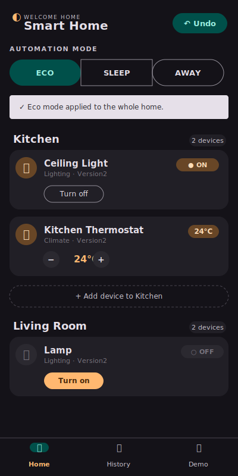 <b>Home</b> Rooms + device cards</td>
    <td align="center">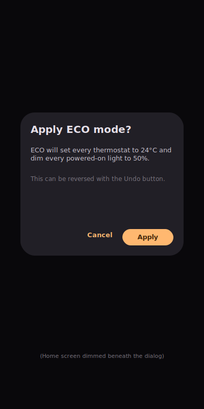 <b>Mode confirm</b> Strategy with consequence dialog</td>
  </tr>
  <tr>
    <td align="center">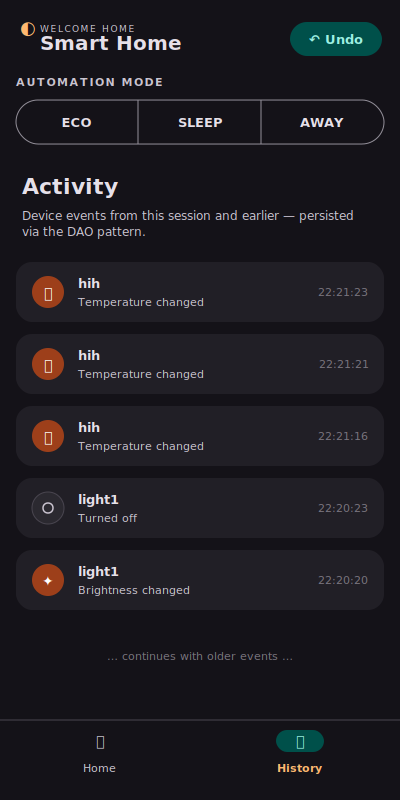 <b>History</b> Observer + DAO live feed</td>
    <td align="center">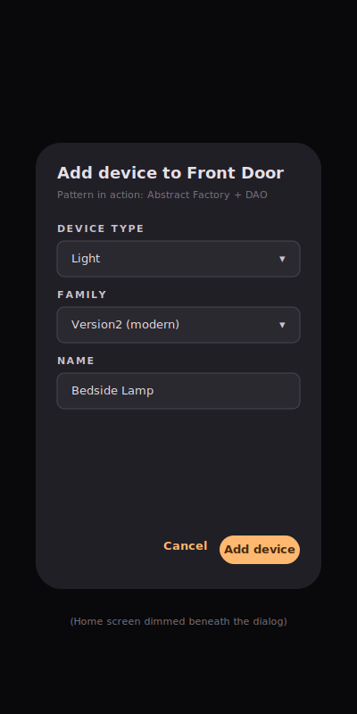 <b>Add device</b> Abstract Factory at runtime</td>
  </tr>
</table>

Run the GUI with `./mvnw javafx:run` (window size 400×800).

---

## 8. References

- Refactoring Guru — pattern reference structures (https://refactoring.guru/design-patterns)
- Gamma, Helm, Johnson, Vlissides — *Design Patterns: Elements of Reusable Object-Oriented Software*
- Sun / Oracle Core J2EE Patterns — DAO definition

*Companion documents (also in the repo): `class-diagram.md`, `class-catalog.md`.*
